# 첫 번째 앱 만들기

 - 안드로이드 스튜디오를 사용한 안드로이드 프로젝트 생성
 - 안드로이드 애뮬레이터 설정 및 앱 실행
 - 안드로이드 매니페스트
 - Gradle을 사용한 앱 빌드, 구성 및 의존성 관리
 - 안드로이드 앱 구조

## 1. 안드로이드 스튜디오를 사용한 안드로이드 프로젝트 생성

 - Name: 앱이 휴대폰에 설치됐을 때의 기본 이름. 구글 플레이에서도 이 이름으로 앱을 보게 된다.
 - Package name: 표준 역도메인 이름 패턴을 사용해 패키지 이름을 생성한다. 패키지 이름은 앱의 소스코드와 에셋을 식별하는 주소로 사용된다. 가능한 한 명확하고 앱의 목적을 잘 설명하는 이름을 사용하는 것이 좋다.
 - Save location: 앱 프로젝트가 저장되는 폴더
 - Minimum SDK: 안드로이드 대부분의 새로운 기능은 하위 호환성이 유지되므로 앱이 대부분의 이전 기기에서 잘 실행된다. 그러나 최신 기기만을 대상으로 하려는 경우 최소 API 레벨을 높이는 것을 고려해야 한다. Help Me Choose 링크를 클릭하면 전 세계에서 각 안드로이드 버전별로 실행되는 기기별 점유율을 확인할 수 있다.
 - Build configuration language: 앱 빌드 및 구성 관련 정보가 저장되는 파일인 build.gradle 파일을 작성할 기본 언어를 선택한다. Kotlin DSL, Groovy DSL 중에 고를 수 있다.

<div align="center">
    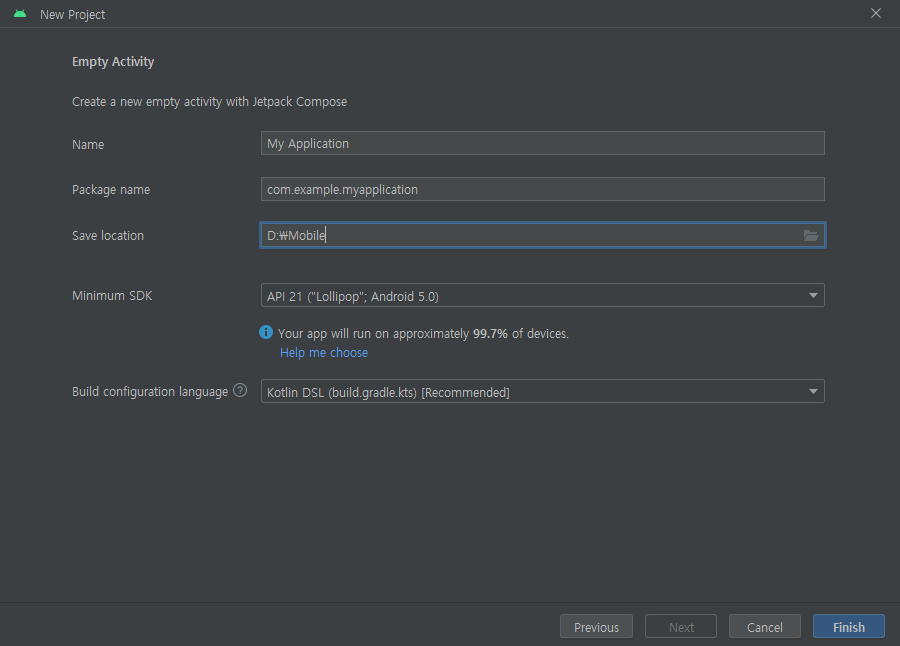
</div>
<br/>

## 2. 가상 기기 설정 및 앱 실행

안드로이드 SDK에는 가상 안드로이드 기기에서 앱을 실행하기 위한 기본 에뮬레이터가 포함돼 있다.

 - Android Emulator: 안드로이드 가상 기기를 생성하기 위한 기본 에뮬레이터로 다양한 안드로이드 제조사와 모델의 가상 기기를 만들 수 있다.
 - Android SDK Build-Tools: 안드로이드 스튜디오는 앱을 빌드하기 위해 비륻 도구를 사용한다. 앱을 컴파일, 링크, 패키징해 기기에 설치하고자 준비한다.
 - Android SDK Platform: 앱 개발에 사용할 안드로이드 플랫폼 버전이다. 플랫폼은 API 레벨을 의미한다.
 - Android SDK Platform-Tools: 일반적으로 커맨드라인에서 앱과 상호작용하고 디버깅하는 데 사용하는 도구이다.
 - Android SDK Tools: Platform-Tools와는 달리 주로 안드로이드 스튜디오 내에서 특정 작업을 수행하기 위해 사용하는 도구다. 예를 들어 앱을 실행하기 위한 에뮬레이터와 플랫폼, 기타 SDK 구성 요소를 다운로드하고 설치하는 SDK manager와 같은 도구를 말한다.
 - Intel x86 Emulator Accelerator: 컴퓨터와 하드웨어 수준에서 제공되는 기능으로, 에뮬레이터를 더 빠르게 실행할 수 있다.
 - SDK Patch Applier v4: 안드로이드 스튜디오의 최신 버전이 추가됐을 때 이를 적용해 실행 중인 버전을 업데이트할 수 있다.

<div align="center">
    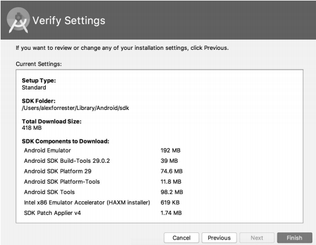
</div>
<br/>

### 2-1. 에뮬레이터 설정 및 에뮬레이터에서 앱 실행

 - 에뮬레이터 생성
    - Tools > Device Manager > Create Device

<div align="center">
    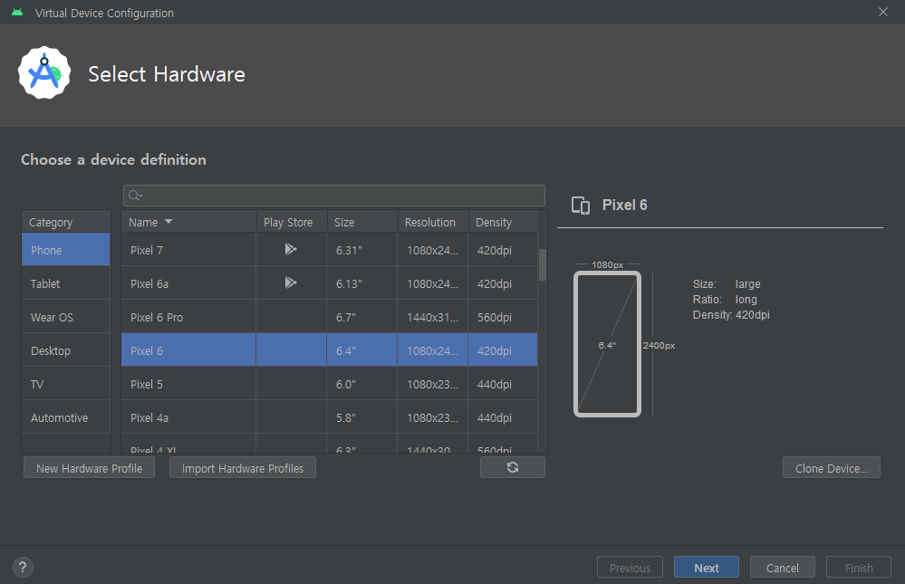<br/>
    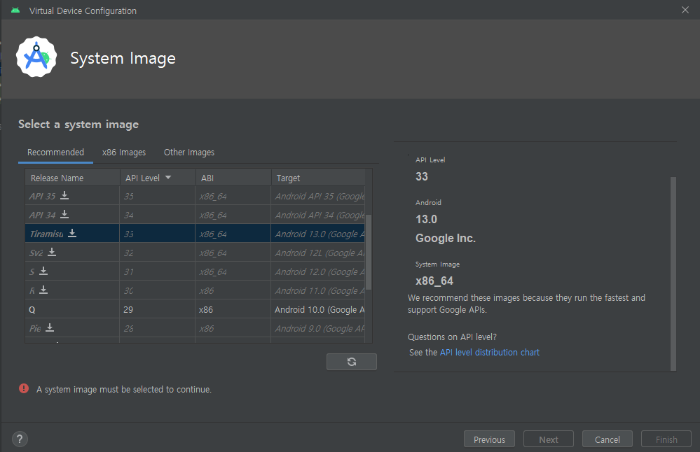<br/>
    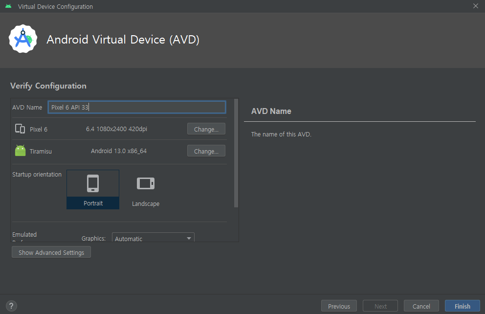<br/>

</div>
<br/>

 - 앱을 에뮬레이터에 로드

<div align="center">
    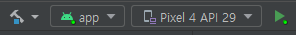<br/>
    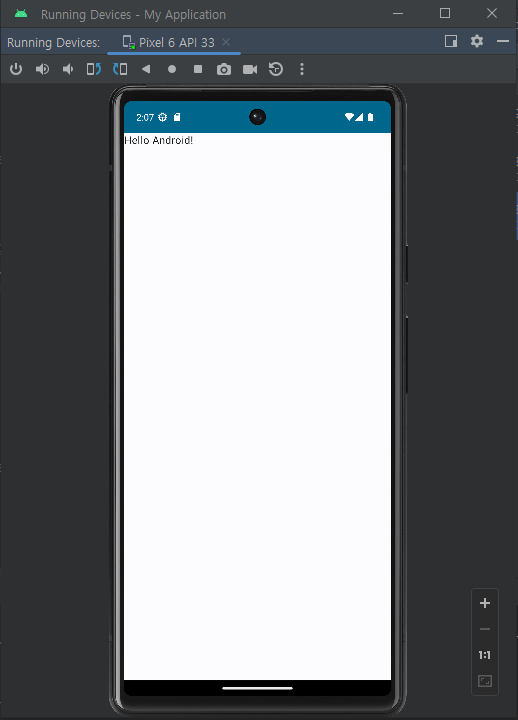
</div>

### 2-2 안드로이드 매니페스트(AndroidManifest.xml)

안드로이드 매니페스트(AndroidManifest.xml) 파일은 안드로이드 애플리케이션의 필수 구성 파일로, 앱에 대한 중요한 정보를 안드로이드 시스템에 제공해주는 역할을 합니다.

일반적으로 매니페스트 파일은 프로젝트에 포함된 파일이나 기타 데이터, 관련 메타데이터의 그룹이나 단위를 설명하는 최상위 파일이다.

 - `AndroidManifest.xml`
    - 앱의 구성 정보 선언: 패키지 이름, 앱에서 사용하는 컴포넌트 등
    - 앱 테마, 아이콘, 이름 등 설정
    - 인텐트 필터 설정: 어떤 액티비티가 런처 액티비티인지 정의
    - 권한 요청: 앱이 인터넷 사용, 카메라 접근, 파일 읽기/쓰기 등을 하기 위해 필요한 권한 선언
```xml
<?xml version="1.0" encoding="utf-8"?>
<manifest xmlns:android="http://schemas.android.com/apk/res/android"
    xmlns:tools="http://schemas.android.com/tools">

    <application
        android:allowBackup="true"
        android:dataExtractionRules="@xml/data_extraction_rules"
        android:fullBackupContent="@xml/backup_rules"
        android:icon="@mipmap/ic_launcher"
        android:label="@string/app_name"
        android:roundIcon="@mipmap/ic_launcher_round"
        android:supportsRtl="true"
        android:theme="@style/Theme.MyApplication"
        tools:targetApi="31">
        <activity
            android:name=".MainActivity"
            android:exported="true"
            android:label="@string/app_name"
            android:theme="@style/Theme.MyApplication">
            <intent-filter>
                <action android:name="android.intent.action.MAIN" />

                <category android:name="android.intent.category.LAUNCHER" />
            </intent-filter>
        </activity>
    </application>

</manifest>
```

 - `권한 범주`
    - 권한은 Normal, Signature, Dangerous라는 3가지 범주로 나뉜다.
    - Normal: 네트워크 상태, 와이파이, 인터넷 및 블루투스에 접근하는 등의 권한이 Normal에 해당된다. 일반적으로 런타임에서 허용되기 때문에 사용자의 동의를 요청하지 않는다.
    - Signature: 동일한 인증서로 서명된 앱들이 공유하는 권한이다. 이러한 앱들은 서로 자유롭게 데이터를 공유할 수 있지만 다른 앱들은 접근할 수 없다.
    - Danagerous: 사용자와 사용자의 개인 정보를 중심으로 하는 권한으로 SMS 전송, 계정 및 위치 접근, 파일 시스템 및 연락처의 읽기 및 쓰기와 같은 작업을 포함한다.
    - 위험한 권한의 경우 안드로이드 마시멜로 API 23 이상부터 사용자에게 권한 부여를 요청해야 한다.

### 2-3. 안드로이드 매니페스트 인터넷 권한 설정 (웹뷰 로드하기)

대부분의 앱에서 필요로 하는 주요 권한은 인터넷 접근이다. 인터넷 접근 권한은 기본적으로 추가되지 않는다.

 - 웹뷰는 대부분의 상용 앱에서 개인 정보 정책, 약관 등을 표시하는 데 널리 사용된다. 이러한 문서들은 모든 플랫폼에서 공통일 가능성이 높으므로 일반적으로 웹 페이지를 로드해 표시한다.

#### 웹뷰 로드하기

 - `MainActivity`
```kotlin
import android.os.Bundle
import android.webkit.WebView
import androidx.activity.ComponentActivity

class MainActivity : ComponentActivity() {
    override fun onCreate(savedInstanceState: Bundle?) {
        super.onCreate(savedInstanceState)
        val webView = WebView(this)
        webView.settings.javaScriptEnabled = true
        setContentView(webView)
        webView.loadUrl("https://www.google.com")
    }
}
```

 - `AndroidManifest.xml`
    - 인터넷 권한을 추가한다.
```xml
<?xml version="1.0" encoding="utf-8"?>
<manifest xmlns:android="http://schemas.android.com/apk/res/android"
    xmlns:tools="http://schemas.android.com/tools">

    <application>..</application>
    <uses-permission android:name="android.permission.INTERNET" />

</manifest>
```

<div align="center">
    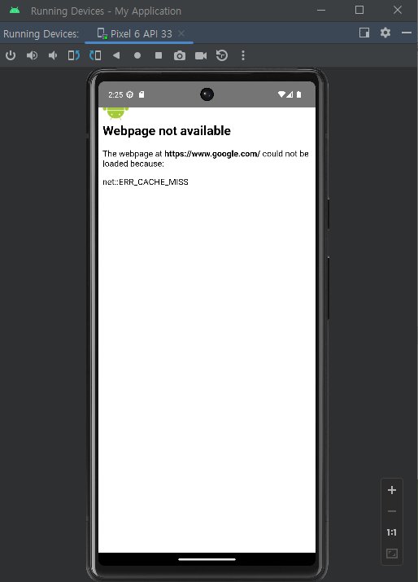<br/>
    AndroidManifest.xml 파일에 INTERNET 권한이 없는 경우
</div>
<div align="center">
    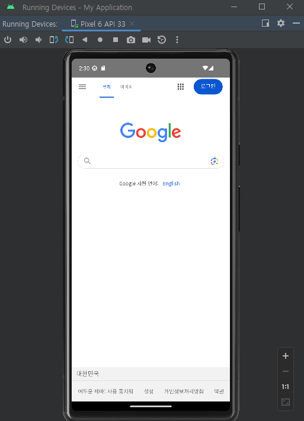
</div>
<br/>

앱 권한이 때로는 캐시에 저장될 수 있기 때문에 앱을 다시 실행하기 전에 에뮬레이터에서 앱을 삭제한다.

앱을 삭제하기 위해서 앱 아이콘을 길게 누르고, App Info 옵션을 선택한 다음, Uninstall을 진행하면 된다. 또는, 앱 아이콘을 길게 누르고 Uninstall을 진행할 수 있다.

## 3. Gradle을 사용한 앱 빌드, 구성 및 종속성 관리

Gradle은 안드로이드 스튜디오에서 앱을 빌드하는 데 사용하는 다목적 빌드 도구다. 기본적으로 안드로이드 스튜디오는 그루비라는 동적으로 타입이 지정되는 자바 가상 머신 언어를 사용해 빌드 프로세스를 구성하며, 라이브러리를 프로젝트에 추가하고 버전을 지정하기 쉽게 의존성 관리를 제공한다.

앱을 처음 만들 때 프로젝트 루트 경로에 build.gradle.kts 파일이 있고, 앱 모듈 폴더 내에 해당 앱에 대한 별도의 build.gradle.kts 파일이 생성된다.

<div align="center">
    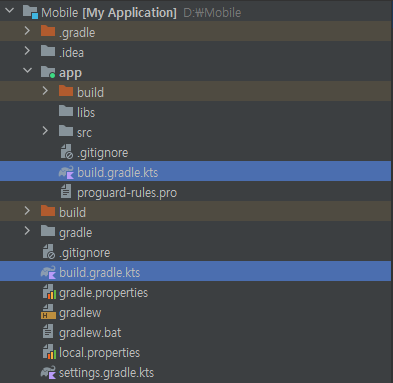
</div>
<br/>

### 3-1. 프로젝트 수준의 build.gradle.kts

 - 하위 모듈/프로젝트에 적용되는 모든 설정 지정
    - com.android.application: 안드로이드 애플리케이션 생성을 지원
    - org.jetbrains.kotlin.android: 프로젝트에서 코틀린의 통합 및 언어 지원
```kotlin
plugins {
    id("com.android.application") version "8.1.1" apply false
    id("org.jetbrains.kotlin.android") version "1.8.10" apply false
}
```

### 3-2. 앱 수준의 build.gradle.kts

 - namespace: 프로젝트를 생성할 떄 지정한 패키지 이름으로 설정되며 빌드 및 리소스 식별자 생성에 사용된다.
 - compileSdk: 앱을 컴파일할 때 사용하는 API 레벨 정의
 - defaultConfig: 앱의 기본 설정
 - applicationId: 기본적으로 앱의 패키지 이름으로 설정되며 구글 플레이에서 앱을 고유하게 식별하는 앱 식별자다. 필요한 경우 패키지 이름과 다르게 변경할 수 있다.
 - minSdk: 앱이 지원하는 최소 API 레벨. 이를 기준으로 지정한 API 레벨보다 낮은 기기에서는 구글 플레이에서 앱이 표시되지 않는다.
 - targetSdk: 앱이 타깃으로 하는 API 레벨이다. 빌드된 앱이 지정된 API 레벨에서 잘 작동하도록 제작되고 테스트됐다는 것을 의미한다.
 - versionCode: 앱의 버전 코드를 지정. 앱을 업데이트해야 할 때마다 버전 코드를 하나 이상 증가시켜야 한다.
 - versionName: 버전 이름 정의. 일반적으로 X.Y.Z의 시멘틱 버저닝 형식을 따른다. X는 메이저, Y는 마이너, Z는 패치 버전을 나타낸다.
 - testInstrumentationRunner: UI 테스트에 사용할 테스트 실행기다.
 - buildTypes: buildTypes 아래에는 릴리스 빌드를 생성하도록 release가 추가된다. minifyEnabled 값이 true로 설정되면 사용되지 않는 코드를 제거하고 앱을 난독화해 앱의 크기를 줄인다. 이 난독화 단계는 소스코드를 a.b.c()와 같은 값으로 변경해 코드가 역공학에 노출될 가능성이 줄어들고 빌드된 앱의 크기도 더 줄어든다.
 - compileOptions: 자바 소스코드와 바이트 코드의 언어 수준
 - kotlinOptions: kotlin gradle 플러그인에서 사용할 jvm 라이브러리를 나타낸다.
```kotlin
plugins {
    id("com.android.application")
    id("org.jetbrains.kotlin.android")
}

android {
    namespace = "com.example.myapplication"
    compileSdk = 33

    defaultConfig {
        applicationId = "com.example.myapplication"
        minSdk = 21
        targetSdk = 33
        versionCode = 1
        versionName = "1.0"

        testInstrumentationRunner = "androidx.test.runner.AndroidJUnitRunner"
        vectorDrawables {
            useSupportLibrary = true
        }
    }

    buildTypes {
        release {
            isMinifyEnabled = false
            proguardFiles(getDefaultProguardFile("proguard-android-optimize.txt"), "proguard-rules.pro")
        }
    }
    compileOptions {
        sourceCompatibility = JavaVersion.VERSION_1_8
        targetCompatibility = JavaVersion.VERSION_1_8
    }
    kotlinOptions {
        jvmTarget = "1.8"
    }
    buildFeatures {
        compose = true
    }
    composeOptions {
        kotlinCompilerExtensionVersion = "1.4.3"
    }
    packaging {
        resources {
            excludes += "/META-INF/{AL2.0,LGPL2.1}"
        }
    }
}

dependencies {
    implementation("androidx.core:core-ktx:1.9.0")
    implementation("androidx.lifecycle:lifecycle-runtime-ktx:2.6.1")
    implementation("androidx.activity:activity-compose:1.7.0")
    implementation(platform("androidx.compose:compose-bom:2023.03.00"))
    implementation("androidx.compose.ui:ui")
    implementation("androidx.compose.ui:ui-graphics")
    implementation("androidx.compose.ui:ui-tooling-preview")
    implementation("androidx.compose.material3:material3")
    testImplementation("junit:junit:4.13.2")
    androidTestImplementation("androidx.test.ext:junit:1.1.5")
    androidTestImplementation("androidx.test.espresso:espresso-core:3.5.1")
    androidTestImplementation(platform("androidx.compose:compose-bom:2023.03.00"))
    androidTestImplementation("androidx.compose.ui:ui-test-junit4")
    debugImplementation("androidx.compose.ui:ui-tooling")
    debugImplementation("androidx.compose.ui:ui-test-manifest")
}
```

 - `build.gradle.kts`
    - 최신 IDE에서는 build.gradle.kts 파일에 라이브러리 관련 정보를 작성하지 않고 별도의 toml 파일에 모아둔다.
```kotlin
dependencies {
    implementation(libs.androidx.core.ktx)
    implementation(libs.androidx.lifecycle.runtime.ktx)
    implementation(libs.androidx.activity.compose)
    implementation(platform(libs.androidx.compose.bom))
    implementation(libs.androidx.ui)
    implementation(libs.androidx.ui.graphics)
    implementation(libs.androidx.ui.tooling.preview)
    implementation(libs.androidx.material3)
    testImplementation(libs.junit)
    androidTestImplementation(libs.androidx.junit)
    androidTestImplementation(libs.androidx.espresso.core)
    androidTestImplementation(platform(libs.androidx.compose.bom))
    androidTestImplementation(libs.androidx.ui.test.junit4)
    debugImplementation(libs.androidx.ui.tooling)
    debugImplementation(libs.androidx.ui.test.manifest)
}
```

 - `gradle/libs.versions.toml`
```conf
[versions]
agp = "8.9.1"
kotlin = "2.0.21"
coreKtx = "1.10.1"
junit = "4.13.2"
junitVersion = "1.1.5"
espressoCore = "3.5.1"
lifecycleRuntimeKtx = "2.6.1"
activityCompose = "1.8.0"
composeBom = "2024.09.00"

[libraries]
androidx-core-ktx = { group = "androidx.core", name = "core-ktx", version.ref = "coreKtx" }
junit = { group = "junit", name = "junit", version.ref = "junit" }
androidx-junit = { group = "androidx.test.ext", name = "junit", version.ref = "junitVersion" }
androidx-espresso-core = { group = "androidx.test.espresso", name = "espresso-core", version.ref = "espressoCore" }
androidx-lifecycle-runtime-ktx = { group = "androidx.lifecycle", name = "lifecycle-runtime-ktx", version.ref = "lifecycleRuntimeKtx" }
androidx-activity-compose = { group = "androidx.activity", name = "activity-compose", version.ref = "activityCompose" }
androidx-compose-bom = { group = "androidx.compose", name = "compose-bom", version.ref = "composeBom" }
androidx-ui = { group = "androidx.compose.ui", name = "ui" }
androidx-ui-graphics = { group = "androidx.compose.ui", name = "ui-graphics" }
androidx-ui-tooling = { group = "androidx.compose.ui", name = "ui-tooling" }
androidx-ui-tooling-preview = { group = "androidx.compose.ui", name = "ui-tooling-preview" }
androidx-ui-test-manifest = { group = "androidx.compose.ui", name = "ui-test-manifest" }
androidx-ui-test-junit4 = { group = "androidx.compose.ui", name = "ui-test-junit4" }
androidx-material3 = { group = "androidx.compose.material3", name = "material3" }

[plugins]
android-application = { id = "com.android.application", version.ref = "agp" }
kotlin-android = { id = "org.jetbrains.kotlin.android", version.ref = "kotlin" }
kotlin-compose = { id = "org.jetbrains.kotlin.plugin.compose", version.ref = "kotlin" }
```

## 4. 안드로이드 앱 구조 

 - app: 앱의 주요 소스 코드와 리소스가 포함된 디렉토리
    - src/androidTest: UI 테스트 및 통합 테스트용 소스 코드 디렉터리
    - src/main/java/**: 액티비티, 프래그먼트, 유틸리티 클래스 등 소스 파일
    - src/main/res/**: 앱의 리소스(이미지, 레이아웃, 문자열 등)를 저장하는 디렉토리
        - drawable/: 이미지, 아이콘, 벡터 파일 등 그래픽 리소스
        - layout/: XML 형식으로 작성된 UI 레이아웃 파일 (예: activity_main.xml)
        - mipmap/: 앱 아이콘 파일 (다양한 해상도 지원)
        - values/: 문자열(strings.xml), 색상(colors.xml), 스타일(styles.xml) 등 정의
        - menu/: 메뉴 리소스 파일 (옵션 메뉴 등)
        - navigation/: Jetpack Navigation 컴포넌트를 사용할 경우 네비게이션 그래프 파일
    - src/main/AndroidManifest.xml: 앱의 기본 설정 파일(앱의 권한, 액티비티, 서비스, 인텐트 필터 등을 정의)
    - src/test/**: 단위 테스트용 소스 코드 디렉터리
 - gradle: Gradle 빌드 시스템 관련 파일
 - build.gradle (프로젝트 수준): 전체 프로젝트의 빌드 설정
 - gradle.properties: Gradle 빌드에 사용할 속성(예: JVM 메모리 설정)을 정의
 - settings.gradle: 프로젝트에 포함된 모듈을 정의

<div align="center">
    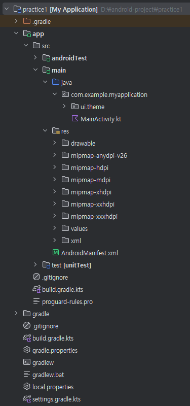
</div>
<br/>

### 4-1. 기본 생성 파일 분석

#### 최신 버전 UI (Jetpack Compose UI)

 - `MainActivity`
    - 2019년 5월: Google I/O 2019에서 Jetpack Compose 첫 공개 (Developer Preview)
    - 2020년 8월: Alpha 버전 출시 – 개발자들이 테스트해볼 수 있는 상태
    - 2021년 2월: Beta 버전 출시 – 주요 기능들 안정화됨
    - 2021년 7월 28일: 1.0 Stable 정식 버전 출시
```kotlin
class MainActivity : ComponentActivity() {
    override fun onCreate(savedInstanceState: Bundle?) {
        super.onCreate(savedInstanceState)
        enableEdgeToEdge()
        setContent {
            MyApplicationTheme {
                Scaffold(modifier = Modifier.fillMaxSize()) { innerPadding ->
                    Greeting(
                        name = "Android",
                        modifier = Modifier.padding(innerPadding)
                    )
                }
            }
        }
    }
}

@Composable
fun Greeting(name: String, modifier: Modifier = Modifier) {
    Text(
        text = "Hello $name!",
        modifier = modifier
    )
}

@Preview(showBackground = true)
@Composable
fun GreetingPreview() {
    MyApplicationTheme {
        Greeting("Android")
    }
}
```

#### 이전 버전 UI (XML 방식)

 - `MainActivity`
```kotlin
class MainActivity : AppCompatActivity() {

    override fun onCreate(savedInstanceState: Bundle?) {
        super.onCreate(savedInstanceState)
        setContentView(R.layout.activity_main)

        val greetingText: TextView = findViewById(R.id.greetingText)
        greetingText.text = "Hello Android!"
    }
}
```

 - `res/layout/activity_main.xml`
```xml
<?xml version="1.0" encoding="utf-8"?>
<androidx.constraintlayout.widget.ConstraintLayout 
    xmlns:android="http://schemas.android.com/apk/res/android"
    xmlns:app="http://schemas.android.com/apk/res-auto"
    android:layout_width="match_parent"
    android:layout_height="match_parent">

    <!-- Greeting Text -->
    <!--
        android:id="@+id/greetingText"
        이 TextView에 "greetingText"라는 고유 ID를 부여
        코드에서 이 ID로 이 뷰에 접근
    -->
    <TextView
        android:id="@+id/greetingText"
        android:layout_width="wrap_content"
        android:layout_height="wrap_content"
        android:text="Hello Android!"
        android:textSize="24sp"
        app:layout_constraintTop_toTopOf="parent"
        app:layout_constraintStart_toStartOf="parent"
        android:layout_margin="16dp"/>
        
</androidx.constraintlayout.widget.ConstraintLayout>
```

##### 주의 사항

 - `신규 프로젝트에 XML 방식 UI 사용하기`
    - Material 관련 XML용 라이브러리 의존성을 추가해야 한다.
```kotlin
dependencies {
    implementation("com.google.android.material:material:1.11.0")
    implementation("androidx.constraintlayout:constraintlayout:2.1.4")

    implementation(libs.androidx.core.ktx)
    implementation(libs.androidx.lifecycle.runtime.ktx)
    implementation(libs.androidx.activity.compose)
    implementation(platform(libs.androidx.compose.bom))
    implementation(libs.androidx.ui)
    implementation(libs.androidx.ui.graphics)
    implementation(libs.androidx.ui.tooling.preview)
    implementation(libs.androidx.material3)
    testImplementation(libs.junit)
    androidTestImplementation(libs.androidx.junit)
    androidTestImplementation(libs.androidx.espresso.core)
    androidTestImplementation(platform(libs.androidx.compose.bom))
    androidTestImplementation(libs.androidx.ui.test.junit4)
    debugImplementation(libs.androidx.ui.tooling)
    debugImplementation(libs.androidx.ui.test.manifest)
}
```

### 4-2. 간단한 입력 UI 실습

 - `main/res/layout/activity_main.xml`
```xml
<?xml version="1.0" encoding="utf-8"?>
<androidx.constraintlayout.widget.ConstraintLayout
    xmlns:android="http://schemas.android.com/apk/res/android"
    xmlns:app="http://schemas.android.com/apk/res-auto"
    xmlns:tools="http://schemas.android.com/tools"
    android:layout_width="match_parent"
    android:layout_height="match_parent"
    style="@style/screen_layout_margin"
    tools:context=".MainActivity">

    <com.google.android.material.textfield.TextInputLayout
        android:id="@+id/first_name_wrapper"
        style="@style/text_input_greeting"
        android:layout_width="match_parent"
        android:layout_height="wrap_content"
        android:hint="@string/first_name_text"
        app:layout_constraintTop_toTopOf="parent"
        app:layout_constraintStart_toStartOf="parent">

        <com.google.android.material.textfield.TextInputEditText
            android:id="@+id/first_name"
            android:layout_width="match_parent"
            android:layout_height="wrap_content" />
    </com.google.android.material.textfield.TextInputLayout>

    <com.google.android.material.textfield.TextInputLayout
        android:id="@+id/last_name_wrapper"
        style="@style/text_input_greeting"
        android:layout_width="match_parent"
        android:layout_height="wrap_content"
        android:hint="@string/last_name_text"
        app:layout_constraintTop_toBottomOf="@id/first_name_wrapper"
        app:layout_constraintStart_toStartOf="parent">

        <com.google.android.material.textfield.TextInputEditText
            android:id="@+id/last_name"
            android:layout_width="match_parent"
            android:layout_height="wrap_content" />
    </com.google.android.material.textfield.TextInputLayout>

    <com.google.android.material.button.MaterialButton
        android:id="@+id/enter_button"
        android:layout_width="match_parent"
        android:layout_height="wrap_content"
        style="@style/button_greeting"
        android:text="@string/enter_button_text"
        app:layout_constraintTop_toBottomOf="@id/last_name_wrapper"
        app:layout_constraintStart_toStartOf="parent" />

    <TextView
        android:id="@+id/greeting_display"
        android:layout_width="match_parent"
        style="@style/greeting_display"
        app:layout_constraintTop_toBottomOf="@id/enter_button"
        app:layout_constraintStart_toStartOf="parent" />

</androidx.constraintlayout.widget.ConstraintLayout>
```

 - `MainActiviy.kt`
```kotlin
class MainActivity : ComponentActivity() {
    override fun onCreate(savedInstanceState: Bundle?) {
        super.onCreate(savedInstanceState)
        setContentView(R.layout.activity_main)
        findViewById<Button>(R.id.enter_button)?.setOnClickListener {
            val greetingDisplay = findViewById<TextView>(R.id.greeting_display)
            val firstName = findViewById<TextInputEditText>(R.id.first_name)
                ?.text.toString().trim()
            val lastName = findViewById<TextInputEditText>(R.id.last_name)
                ?.text.toString().trim()

            if (firstName.isNotEmpty() && lastName.isNotEmpty()) {
                val nameToDisplay = firstName.plus(" ").plus(lastName)
                greetingDisplay?.text = " ${getString(R.string.welcome_to_the_app)} ${nameToDisplay}!"
            } else {
                Toast.makeText(this, getString(R.string.please_enter_a_name), Toast.LENGTH_LONG)
                    .apply {
                        setGravity(Gravity.CENTER, 0, 0)
                        show()
                    }
            }
        }
    }
}
```

<div align="center">
    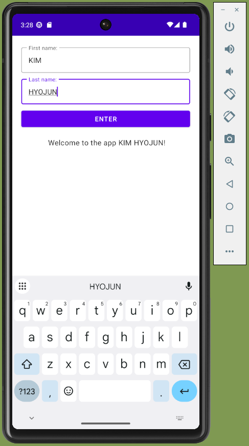
</div>

#### 에뮬레이터 터치되지 않는 이슈

 - https://gaebal-saebal.tistory.com/7
 - Setting > Tools > Emulator > Launch in Running Devices tool window
    - Launch in the Running Devices tool window 터치 해제

#### 4-3. RGB 색상 표시 UI 실습

<div align="center">
    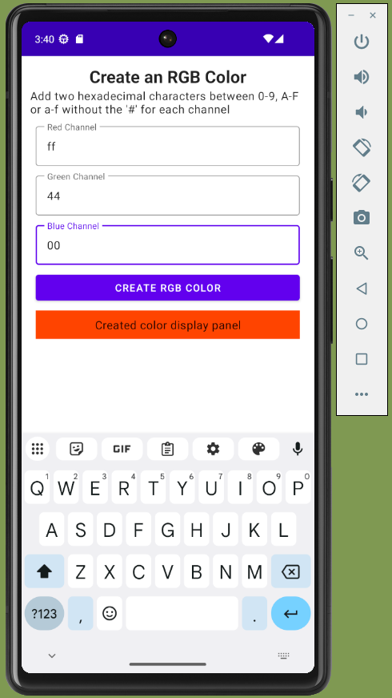
</div>
<br/>

 - `MainActivity.kt`
```kotlin
class MainActivity : AppCompatActivity() {
    override fun onCreate(savedInstanceState: Bundle?) {
        super.onCreate(savedInstanceState)
        setContentView(R.layout.activity_main)

        findViewById<Button>(R.id.color_creator_button)?.setOnClickListener {
            var redChannelText = findViewById<TextInputEditText>(R.id.red_channel)?.text.toString()
            var greenChannelText = findViewById<TextInputEditText>(R.id.green_channel)?.text.toString()
            var blueChannelText = findViewById<TextInputEditText>(R.id.blue_channel)?.text.toString()

            // Check that all fields are filled in and show error message if not.
            if (redChannelText.isEmpty() or greenChannelText.isEmpty() or blueChannelText.isEmpty()) {
                Toast.makeText(this, "All Values are required", Toast.LENGTH_LONG).show()
            } else {
                // check that 2 hexadecimal characters have been entered and if not add the same hexadecimal character again.
                if (redChannelText.length == 1) redChannelText = redChannelText.plus(redChannelText)
                if (greenChannelText.length == 1) greenChannelText = greenChannelText.plus(greenChannelText)
                if (blueChannelText.length == 1) blueChannelText = blueChannelText.plus(blueChannelText)

                val colorToDisplay = redChannelText.plus(greenChannelText).plus(blueChannelText)

                val colorAsInt = Color.parseColor("#".plus(colorToDisplay))
                findViewById<TextView>(R.id.color_creator_display)?.setBackgroundColor(colorAsInt)
            }
        }
    }
}
```

 - `res/layout/activity_main.xml`
```xml
<?xml version="1.0" encoding="utf-8"?>
<androidx.constraintlayout.widget.ConstraintLayout
    xmlns:android="http://schemas.android.com/apk/res/android"
    xmlns:app="http://schemas.android.com/apk/res-auto"
    xmlns:tools="http://schemas.android.com/tools"
    android:layout_width="match_parent"
    android:layout_height="match_parent"
    style="@style/screen_layout_margin"
    tools:context=".MainActivity">

    <TextView
        android:layout_width="match_parent"
        android:id="@+id/color_creator_title"
        android:layout_height="wrap_content"
        style="@style/color_creator_title"
        android:gravity="center"
        android:text="@string/color_creator_title"
        app:layout_constraintTop_toTopOf="parent"
        app:layout_constraintStart_toStartOf="parent"/>

    <TextView
        android:layout_width="match_parent"
        android:id="@+id/color_creator_description"
        android:layout_height="wrap_content"
        style="@style/color_creator_description"
        android:text="@string/color_creator_description"
        app:layout_constraintTop_toBottomOf="@id/color_creator_title"
        app:layout_constraintStart_toStartOf="parent"/>

        <com.google.android.material.textfield.TextInputLayout
            android:id="@+id/red_channel_wrapper"
            style="@style/color_input"
            android:layout_width="match_parent"
            android:layout_height="wrap_content"
            android:hint="@string/red_channel"
            app:layout_constraintTop_toBottomOf="@id/color_creator_description"
            app:layout_constraintStart_toStartOf="parent">

            <com.google.android.material.textfield.TextInputEditText
                android:id="@+id/red_channel"
                android:inputType="textCapCharacters"
                android:digits="ABCDEFabcdef0123456789"
                android:layout_width="match_parent"
                android:layout_height="wrap_content"
                android:maxLength="2" />

        </com.google.android.material.textfield.TextInputLayout>

        <com.google.android.material.textfield.TextInputLayout
            android:id="@+id/green_channel_wrapper"
            style="@style/color_input"
            android:layout_width="match_parent"
            android:layout_height="wrap_content"
            android:hint="@string/green_channel"
            app:layout_constraintTop_toBottomOf="@id/red_channel_wrapper"
            app:layout_constraintStart_toStartOf="parent">

            <com.google.android.material.textfield.TextInputEditText
                android:id="@+id/green_channel"
                android:inputType="textCapCharacters"
                android:digits="ABCDEFabcdef0123456789"
                android:layout_width="match_parent"
                android:layout_height="wrap_content"
                android:maxLength="2"/>

        </com.google.android.material.textfield.TextInputLayout>

        <com.google.android.material.textfield.TextInputLayout
            android:id="@+id/blue_channel_wrapper"
            style="@style/color_input"
            android:layout_width="match_parent"
            android:layout_height="wrap_content"
            android:hint="@string/blue_channel"
            app:layout_constraintTop_toBottomOf="@id/green_channel_wrapper"
            app:layout_constraintStart_toStartOf="parent">

            <com.google.android.material.textfield.TextInputEditText
                android:id="@+id/blue_channel"
                android:inputType="textCapCharacters"
                android:digits="ABCDEFabcdef0123456789"
                android:layout_width="match_parent"
                android:layout_height="wrap_content"
                android:maxLength="2" />

        </com.google.android.material.textfield.TextInputLayout>

        <com.google.android.material.button.MaterialButton
            android:layout_width="match_parent"
            android:layout_height="wrap_content"
            style="@style/color_button"
            android:id="@+id/color_creator_button"
            android:gravity="center"
            android:text="@string/color_creator_button_text"
            app:layout_constraintTop_toBottomOf="@id/blue_channel_wrapper"
            app:layout_constraintStart_toStartOf="parent"/>

        <TextView
            android:id="@+id/color_creator_display"
            android:layout_width="match_parent"
            style="@style/color_display"
            android:text="@string/color_created_display_panel"
            android:layout_height="40dp"
            android:layout_margin="8dp"
            app:layout_constraintTop_toBottomOf="@id/color_creator_button"
            app:layout_constraintStart_toStartOf="parent" />

</androidx.constraintlayout.widget.ConstraintLayout>
```
