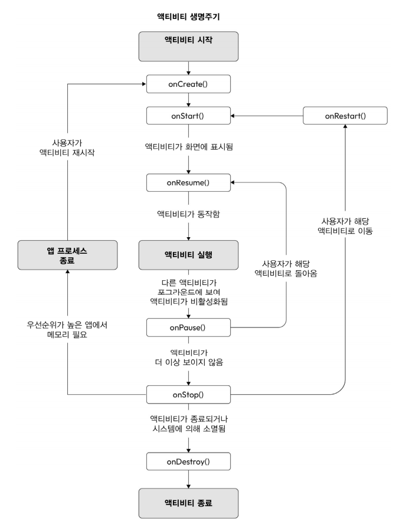

# 사용자 화면 흐름 생성

 - 액티비티 생명주기
 - 액티비티 상태 저장 및 복원
 - 인텐트와의 액티비티 상호작용
 - 인텐트, 태스크 및 런치 모드

## 1. 액티비티 생명주기

 - `onCreate(savedInstanceState: Bundle?)`
    - 전체 화면을 그리는 액티비티에서 가장 많이 사용되는 콜백. 액티비티 레이아웃을 표시할 준비를 한다. 
    - onCreate는 액티비티 생명주기에서 일반적으로 한 번만 호출되는데, 액티비티가 다시 생성되는 경우에는 추가로 호출된다. (세로모드에서 가로모드로 전환하는 경우)
 - `onRestart()`
    - __액티비티가 다시 시작될 떄 onRrestart()가 호출된다.__
    - 액티비티를 다시 생성하는 것과 액티비티를 다시 시작하는 것의 차이를 명확히 이해하는 것이 중요하다.
    - 홈 버튼을 눌러 액티비티가 백그라운드로 이동한 후 다시 포어그라운드로 돌아올 떄 onRestart()가 호출된다.
    - 기기가 회전되는 등의 구성 변경이 일어날 경우 액티비티를 다시 생성하며, 이때 액티비티는 완전히 종료되고 다시 생성된다. 이 경우에는 onRestart()가 호출되지 않는다.
 - `onStart()`
    - 액티비티가 백그라운드에서 포어그라운드로 이동할 떄 수행되는 첫 번쨰 콜백.
 - `onRestoreInstanceState(savedInstanceState: Bundle?)`
    - onSaveInstanceState(outState: Bundle?)를 사용해 상태를 저장한 경우 onStart() 이후에 호출되는 메서드
    - onCreate(savedInstanceState: Bundle?)를 사용해 상태를 복원하는 대신에 여기서 Bundle 상태를 복원할 수 있다.
 - `onResume()`
    - 액티비티가 처음 생성되는 과정에서 마지막으로 실행되는 콜백
    - 앱이 백그라운드에 있다가 포어그라운드로 돌아올 떄에도 실행된다.
    - 이 콜백이 완료되면 화면/액티비티는 사용이 가능하고 사용자 이벤트를 받을 수 있으며 응답할 준비가 된다.
 - `onSaveInstanceState(outState: Bundle?)`
    - 액티비티의 상태를 저장하고 싶다면 이 함수를 사용할 수 있다.
    - 데이터 유형에 따라 이에 맞는 함수를 사용해 키-값 쌍을 추가한다.
    - 액티비티가 다시 생성되는 경우 onCreate() 및 onRestoreInstanceState()에서 해당 데이터를 사용할 수 있다.
 - `onPause()`
    - 액티비티가 백그라운드로 전환될 떄 또는 다른 대화상자나 액티비티가 전면에 나타날 떄 호출된다.
 - `onStop()`
    - 액티비티가 가려질 떄 호출된다.
    - 액티비티가 백그라운드로 이동되거나 다른 액티비티가 위에 표시될 때 호출된다.
 - `onDestroy()`
    - 시스템 자원이 부족해 액티비티에서 명시적으로 finish()가 호출돼 액티비티가 종료될 떄 또는 사용자가 최근 화면 버튼을 통해 앱을 닫았을 때 호출된다.

<div align="center">
    
</div>
<br/>

### 액티비티 회전시 재생성 방지

액티비티를 회전할 때 액티비티를 다시 생성하지 않으려면 AndroidManifest.xml 파일의 MainActivity에 android:configChanges="orientation|screenSize|screenLayout"을 추가한다.

다른 안드로이드 API 수준에서는 orientation과 screenSize 값으로 화면 회전을 감지한다. screenLayout 값은 폴더블 폰에서 발생할 수 있는 레이아웃 변경을 감지한다.

이러한 것들은 사용자가 직접 처리할 수 있는 몇 가지 설정 사항이다. 앱은 시스템에 의해 이러한 변경 사항을 다음 콜백을 사용해 알아차릴 수 있다.

```kotlin
override fun onConfigurationChanged(newConfig: Configuration) {
    super.onConfigurationChanged(newConfig)
    Log.d("MainActivity", "onConfigurationChanged")
}
```

액티비티를 다시 시작하지 않는 방식은 권장하지 않는다. 시스템이 자동으로 대체 리소스를 적용하지 않기 때문이다. 따라서 기기를 세로 모드에서 가로 모드로 회전시키면 이에 적합한 가로 레이아웃이 적용되지 않는다.

## 2. 액티비티 상태 저장 및 복원

기기를 회전하는 등의 구성 변경은 액티비티를 다시 생성한다. 또한 시스템이 메모리를 확보하기 위해 앱을 종료하는 경우에도 액티비티가 다시 생성된다.

 - `레이아웃에서 상태 저장 및 복원`
    - EditText 필드의 경우 ID가 설정돼 있는 경우에만 안드로이드 프레임워크가 필드의 상태를 보존해준다.
    - TextView와 같은 다른 필드 유형은 ID를 설정하더라도 업데이트 시 상태가 유지되지 않으며 상태를 직접 저장해야 한다.
    - RecyclerView와 같은 스크롤 기능을 제공하는 뷰에 ID를 설정하는 것도 중요하다. RecyclerView에 ID를 설정하면 액티비티가 다시 생성됐을 때 스크롤 위치를 유지할 수 있다.


