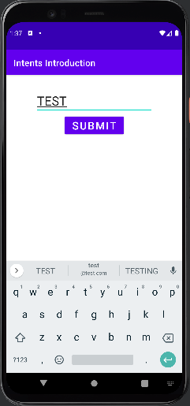

# 사용자 화면 흐름 생성

 - 액티비티 생명주기
 - 액티비티 상태 저장 및 복원
 - 인텐트와의 액티비티 상호작용
 - 인텐트, 태스크 및 런치 모드

## 1. 액티비티 생명주기

 - `onCreate(savedInstanceState: Bundle?)`
    - 전체 화면을 그리는 액티비티에서 가장 많이 사용되는 콜백. 액티비티 레이아웃을 표시할 준비를 한다. 
    - onCreate는 액티비티 생명주기에서 일반적으로 한 번만 호출되는데, 액티비티가 다시 생성되는 경우에는 추가로 호출된다. (세로모드에서 가로모드로 전환하는 경우)
 - `onRestart()`
    - __액티비티가 다시 시작될 떄 onRrestart()가 호출된다.__
    - 액티비티를 다시 생성하는 것과 액티비티를 다시 시작하는 것의 차이를 명확히 이해하는 것이 중요하다.
    - 홈 버튼을 눌러 액티비티가 백그라운드로 이동한 후 다시 포어그라운드로 돌아올 떄 onRestart()가 호출된다.
    - 기기가 회전되는 등의 구성 변경이 일어날 경우 액티비티를 다시 생성하며, 이때 액티비티는 완전히 종료되고 다시 생성된다. 이 경우에는 onRestart()가 호출되지 않는다.
 - `onStart()`
    - 액티비티가 백그라운드에서 포어그라운드로 이동할 떄 수행되는 첫 번쨰 콜백.
 - `onRestoreInstanceState(savedInstanceState: Bundle?)`
    - onSaveInstanceState(outState: Bundle?)를 사용해 상태를 저장한 경우 onStart() 이후에 호출되는 메서드
    - onCreate(savedInstanceState: Bundle?)를 사용해 상태를 복원하는 대신에 여기서 Bundle 상태를 복원할 수 있다.
 - `onResume()`
    - 액티비티가 처음 생성되는 과정에서 마지막으로 실행되는 콜백
    - 앱이 백그라운드에 있다가 포어그라운드로 돌아올 떄에도 실행된다.
    - 이 콜백이 완료되면 화면/액티비티는 사용이 가능하고 사용자 이벤트를 받을 수 있으며 응답할 준비가 된다.
 - `onSaveInstanceState(outState: Bundle?)`
    - 액티비티의 상태를 저장하고 싶다면 이 함수를 사용할 수 있다.
    - 데이터 유형에 따라 이에 맞는 함수를 사용해 키-값 쌍을 추가한다.
    - 액티비티가 다시 생성되는 경우 onCreate() 및 onRestoreInstanceState()에서 해당 데이터를 사용할 수 있다.
 - `onPause()`
    - 액티비티가 백그라운드로 전환될 떄 또는 다른 대화상자나 액티비티가 전면에 나타날 떄 호출된다.
 - `onStop()`
    - 액티비티가 가려질 떄 호출된다.
    - 액티비티가 백그라운드로 이동되거나 다른 액티비티가 위에 표시될 때 호출된다.
 - `onDestroy()`
    - 시스템 자원이 부족해 액티비티에서 명시적으로 finish()가 호출돼 액티비티가 종료될 떄 또는 사용자가 최근 화면 버튼을 통해 앱을 닫았을 때 호출된다.

<div align="center">
    
</div>
<br/>

### 액티비티 회전시 재생성 방지

액티비티를 회전할 때 액티비티를 다시 생성하지 않으려면 AndroidManifest.xml 파일의 MainActivity에 android:configChanges="orientation|screenSize|screenLayout"을 추가한다.

다른 안드로이드 API 수준에서는 orientation과 screenSize 값으로 화면 회전을 감지한다. screenLayout 값은 폴더블 폰에서 발생할 수 있는 레이아웃 변경을 감지한다.

이러한 것들은 사용자가 직접 처리할 수 있는 몇 가지 설정 사항이다. 앱은 시스템에 의해 이러한 변경 사항을 다음 콜백을 사용해 알아차릴 수 있다.

```kotlin
override fun onConfigurationChanged(newConfig: Configuration) {
    super.onConfigurationChanged(newConfig)
    Log.d("MainActivity", "onConfigurationChanged")
}
```

액티비티를 다시 시작하지 않는 방식은 권장하지 않는다. 시스템이 자동으로 대체 리소스를 적용하지 않기 때문이다. 따라서 기기를 세로 모드에서 가로 모드로 회전시키면 이에 적합한 가로 레이아웃이 적용되지 않는다.

## 2. 액티비티 상태 저장 및 복원

기기를 회전하는 등의 구성 변경은 액티비티를 다시 생성한다. 또한 시스템이 메모리를 확보하기 위해 앱을 종료하는 경우에도 액티비티가 다시 생성된다.

 - `레이아웃에서 상태 저장 및 복원`
    - EditText 필드의 경우 ID가 설정돼 있는 경우에만 안드로이드 프레임워크가 필드의 상태를 보존해준다.
    - TextView와 같은 다른 필드 유형은 ID를 설정하더라도 업데이트 시 상태가 유지되지 않으며 상태를 직접 저장해야 한다.
    - RecyclerView와 같은 스크롤 기능을 제공하는 뷰에 ID를 설정하는 것도 중요하다. RecyclerView에 ID를 설정하면 액티비티가 다시 생성됐을 때 스크롤 위치를 유지할 수 있다.

### 콜백을 사용해 상태 저장 및 복원

<div align="center">
   
</div>
<br/>

 - `MainActivity.kt`
   - onSaveInstanceState: 액티비티가 백그라운드로 전환되건 소멸될 때 키-값 쌍을 저장할 수 있게 해준다.
   - 저장된 키-값 쌍은 onCreate 혹은 onRestoreInstanceState에서 복원할 수 있다.
```kotlin
class MainActivity : AppCompatActivity() {

    private val discountButton: Button
        get() = findViewById(R.id.discount_button)
    private val firstName: EditText
        get() = findViewById(R.id.first_name)
    private val lastName: EditText
        get() = findViewById(R.id.last_name)
    private val email: EditText
        get() = findViewById(R.id.email)
    private val discountCodeConfirmation: TextView
        get() = findViewById(R.id.discount_code_confirmation)
    private val discountCode: TextView
        get() = findViewById(R.id.discount_code)

    override fun onCreate(savedInstanceState: Bundle?) {
        super.onCreate(savedInstanceState)
        setContentView(R.layout.main)
        Log.d(TAG, "onCreate")
        
        // DISCOUNT 버튼 클릭 이벤트
        discountButton.setOnClickListener {
            val firstName = firstName.text.toString().trim()
            val lastName = lastName.text.toString().trim()
            val email = email.text.toString()
            if (firstName.isEmpty() || lastName.isEmpty() || email.isEmpty()) {
                // Input에 입력이 없는 경우
                Toast.makeText(this, getString(R.string.add_text_validation), Toast.LENGTH_LONG)
                    .show()
            } else {
                val fullName = firstName.plus(" ").plus(lastName)
                discountCodeConfirmation.text =
                    getString(R.string.discount_code_confirmation, fullName)
                discountCode.text = UUID.randomUUID().toString().take(8).uppercase()
                hideKeyboard()
            }
        }
    }

   // 인스턴스 상태 복원
    override fun onRestoreInstanceState(savedInstanceState: Bundle) {
        super.onRestoreInstanceState(savedInstanceState)
        Log.d(TAG, "onRestoreInstanceState")
        // Get the discount code or an empty string if it hasn't been set
        discountCode.text = savedInstanceState.getString(DISCOUNT_CODE,"")
        // Get the discount confirmation message or an empty string if it hasn't been set
        discountCodeConfirmation.text = savedInstanceState.getString(DISCOUNT_CONFIRMATION_MESSAGE,"")
    }

   // 인스턴스 상태 저장
    override fun onSaveInstanceState(outState: Bundle) {
        super.onSaveInstanceState(outState)
        Log.d(TAG, "onSaveInstanceState")
        outState.putString(DISCOUNT_CODE, discountCode.text.toString())
        outState.putString(DISCOUNT_CONFIRMATION_MESSAGE, discountCodeConfirmation.text.toString())
    }

    private fun hideKeyboard() {
        if (currentFocus != null) {
            val imm = getSystemService(Context.INPUT_METHOD_SERVICE) as InputMethodManager
            imm.hideSoftInputFromWindow(currentFocus?.windowToken, 0)
        }
    }

    companion object {
        private const val TAG = "MainActivity"
        private const val DISCOUNT_CONFIRMATION_MESSAGE = "DISCOUNT_CONFIRMATION_MESSAGE"
        private const val DISCOUNT_CODE = "DISCOUNT_CODE"
    }
}
```

 - `res/layout/activity_main.xml`
```xml
<?xml version="1.0" encoding="utf-8"?>
<androidx.constraintlayout.widget.ConstraintLayout
    xmlns:android="http://schemas.android.com/apk/res/android"
    xmlns:app="http://schemas.android.com/apk/res-auto"
    xmlns:tools="http://schemas.android.com/tools"
    android:layout_width="match_parent"
    android:layout_height="match_parent"
    android:padding="4dp"
    android:layout_marginTop="4dp"
    tools:context=".MainActivity">
    <TextView
        android:id="@+id/header_text"
        android:gravity="center"
        android:textSize="20sp"
        android:paddingStart="8dp"
        android:paddingEnd="8dp"
        android:layout_width="wrap_content"
        android:layout_height="wrap_content"
        android:text="@string/header_text"
        app:layout_constraintTop_toTopOf="parent"
        app:layout_constraintEnd_toEndOf="parent"
        app:layout_constraintStart_toStartOf="parent" />

   <!-- 이름 입력창 -->
    <EditText
        android:id="@+id/first_name"
        android:textSize="20sp"
        android:layout_marginStart="24dp"
        android:layout_marginEnd="16dp"
        android:layout_width="wrap_content"
        android:layout_height="wrap_content"
        android:hint="@string/first_name_label"
        android:inputType="text"
        app:layout_constraintTop_toBottomOf="@id/header_text"
        app:layout_constraintStart_toStartOf="parent"
        />
    <EditText
        android:id="@+id/last_name"
        android:textSize="20sp"
        android:layout_marginEnd="24dp"
        android:layout_width="wrap_content"
        android:layout_height="wrap_content"
        android:hint="@string/last_name_label"
        android:inputType="text"
        app:layout_constraintTop_toBottomOf="@id/header_text"
        app:layout_constraintStart_toEndOf="@id/first_name"
        app:layout_constraintEnd_toEndOf="parent" />

   <!-- 이메일 입력창 -->
    <EditText
        android:id="@+id/email"
        android:textSize="20sp"
        android:layout_marginStart="24dp"
        android:layout_marginEnd="32dp"
        android:layout_width="match_parent"
        android:layout_height="wrap_content"
        android:hint="@string/email_label"
        android:inputType="textEmailAddress"
        app:layout_constraintTop_toBottomOf="@id/first_name"
        app:layout_constraintEnd_toEndOf="parent"
        app:layout_constraintStart_toStartOf="parent" />

   <!-- Discount 버튼 -->
    <Button
        android:id="@+id/discount_button"
        android:textSize="20dp"
        android:layout_marginTop="12dp"
        android:gravity="center"
        android:layout_width="wrap_content"
        android:layout_height="wrap_content"
        android:text="@string/discount_code_button"
        app:layout_constraintTop_toBottomOf="@id/email"
        app:layout_constraintEnd_toEndOf="parent"
        app:layout_constraintStart_toStartOf="parent"/>

   <!-- Discount Code 관련 텍스트 뷰 -->
    <TextView
        android:id="@+id/discount_code_confirmation"
        android:gravity="center"
        android:textSize="20sp"
        android:paddingStart="16dp"
        android:paddingEnd="16dp"
        android:layout_marginTop="8dp"
        android:layout_width="match_parent"
        android:layout_height="wrap_content"
        app:layout_constraintTop_toBottomOf="@id/discount_button"
        app:layout_constraintEnd_toEndOf="parent"
        app:layout_constraintStart_toStartOf="parent"
        tools:text="Hey John Smith! Here is your discount code" />
    <TextView
        android:id="@+id/discount_code"
        android:gravity="center"
        android:textSize="20sp"
        android:textStyle="bold"
        android:layout_marginTop="8dp"
        android:layout_width="match_parent"
        android:layout_height="wrap_content"
        app:layout_constraintTop_toBottomOf="@id/discount_code_confirmation"
        app:layout_constraintEnd_toEndOf="parent"
        app:layout_constraintStart_toStartOf="parent"
        tools:text="XHFG6H9O" />

</androidx.constraintlayout.widget.ConstraintLayout>
```

 - `ViewModel`
   - 안드로이드 프레임워크는 생명 주기를 인식하는 ViewModel이라는 안드로이드 아키텍처 컴포넌트도 제공한다.
   - ViewModel을 사용해 상태를 저장하고 복원하는 메커니즘은 프레임워크에 의해 관리되므로 실습처럼 명시적으로 관리할 필요가 없다.

<br/>

## 3. 인텐트를 통한 액티비티 간 상호작용

안드로이드에서 인텐트는 컴포넌트 간의 통신 메커니즘이다. 인텐트는 메시징 객체로, 다른 앱 구성 요소로부터 작업을 요청하는 데 사용할 수 있다.

즉, 인텐트는 다른 액티비티 혹은 서비스를 시작하기 위해 보내는 메시지이거나, 안드로이드 시스템에서 발생하는 이벤트들을 앱에게 알리기 위한 브로드 캐스트를 전달하기 위한 메시지라고 설명할 수 있다.

### 3-1. 인텐트 종류

 - `명시적 인텐트`
   - 내가 호출할 대상 컴포넌트를 정확히 지정해서 호출
   - 예시: Intent(this, DetailActivity::class.java)
```kotlin
// 액티비티 이동
val intent = Intent(this, DetailActivity::class.java)
intent.putExtra("userId", 123)
startActivity(intent)
```

 - `암시적 인텐트`
   - 어떤 작업을 할지 의도만 알려주고, 적절한 컴포넌트를 시스템이 선택
   - 예시: 전화 앱, 카메라 앱 등 호출
   - 명시적 인텐트와 달리 전달 객체에 대해서 특정한 구성 요소를 지정하지 않는다. 대신 특정한 작업을 지정하여, 지정한 작업을 수행할 수 있는 구성 요소에 요청할 수 있다.
```kotlin
// 전화 걸기
val intent = Intent(Intent.ACTION_DIAL)
intent.data = Uri.parse("tel:01012345678")
startActivity(intent)
```

<div align="center">
   
</div>
<br/>

### 3-2. 인텐트 필터

암시적 인텐트에서 인텐트의 조건을 만족시키는지 확인하기 위해서 인텐트 필터를 확인한다. 인텐트 필터는 말 그대로 조건을 만족하는지 확인하고, 필터링 해주는 역할을 하는 존재로서 해당 구성요소가 수신하고자 하는 인텐트 유형을 나타낸다.

 - 시스템은 매니페스트 파일에 정의된 인텐트 필터를 통해서 요청할 구성 요소를 찾을 수 있다.
 - 시스템이 암시적 인텐트(Implicit Intent)를 해당 컴포넌트에 전달할 수 있도록 해주는 기준

```xml
<!--
   <action>:   어떤 동작인지 명시 (예: VIEW, SEND, MAIN 등)
   <category>: 어떤 종류의 인텐트인지 (예: DEFAULT, LAUNCHER, BROWSABLE)
   <data>:     어떤 데이터 형식을 다루는지 (예: URI, MIME 타입 등)
-->

<!-- 
   앱 시작 액티비티 (런처 등록) 
   앱 아이콘을 누르면 시작되는 액티비티를 정의하는 필터
-->
<activity android:name=".MainActivity">
    <intent-filter>
        <action android:name="android.intent.action.MAIN" />
        <category android:name="android.intent.category.LAUNCHER" />
    </intent-filter>
</activity>
```

### 3-3. 인텐트 필터 이해하기

 - `인텐트 필터 예시`
```xml
<!--
   외부에서 특정 링크로 앱 열기 (딥링크)
   사용자가 브라우저에서 https://www.example.com/products/123
   같은 링크를 클릭하면 앱의 WebActivity가 실행되도록 하는 필터
-->
<activity android:name=".WebActivity">
    <intent-filter>
        <!-- 뭔가 보여달라는 요청이 들어왔을 때 처리 -->
        <action android:name="android.intent.action.VIEW" />

        <!-- 브라우저에서 오는 요청도 허용 -->
        <category android:name="android.intent.category.DEFAULT" />
        <category android:name="android.intent.category.BROWSABLE" />
        
        <!-- 해당 도메인 경로에 반응 -->
        <data android:scheme="https"
              android:host="www.example.com"
              android:pathPrefix="/products/" />
    </intent-filter>
</activity>
```

 - `딥링크`
   - 웹 브라우저, 이메일, 문자, SNS 등 외부에서 클릭한 링크를 내 앱의 특정 화면(액티비티)으로 연결시키는 기능
```
아래 링크를 클릭했을 때,
웹 브라우저가 뜨는 대신 내 앱이 실행되면서 WebActivity가 열린다.
https://www.example.com/products/123
```

#### 이게 어떻게 가능한가?

안드로이드 시스템은 "이 URL을 처리할 수 있는 앱이 있는지?" 찾는다. 그때 앱의 AndroidManifest.xml에 선언된 intent-filter를 보고 연결해준다.

 - __안드로이드 시스템은 설치된 모든 앱의 매니페스트에서 intent-filter를 스캔하고, 그 정보를 내부적으로 캐싱한다.__
   - 안드로이드 시스템(패키지 매니저)은 앱을 설치하거나 업데이트할 때,
   - AndroidManifest.xml을 파싱해서 모든 컴포넌트(Activity, Service, Receiver)의 intent-filter 정보를 수집한다.
   - 이 정보는 시스템 내부 DB에 인텐트 매칭 테이블로 저장된다.
 - `브라우저 URL 링크 과정`
   - 인텐트 생성: URL을 열기 위한 인텐트(예: ACTION_VIEW와 http:// 또는 https:// 스킴)가 생성됩니다.
   - 캐시된 정보 조회: 시스템은 캐싱된 intent-filter 정보를 바탕으로 해당 인텐트를 처리할 수 있는 앱/액티비티를 찾습니다. 앱의 매니페스트 파일에 정의된 intent-filter 태그를 통해 어떤 앱이 특정 스킴(예: http, https)이나 액션을 처리할 수 있는지 확인합니다.
   - 앱 선택: 일치하는 앱이 하나라면 바로 해당 액티비티가 실행됩니다. 여러 앱이 일치하면 사용자에게 선택 다이얼로그(예: 브라우저 선택창)가 표시됩니다.
   - 실행: 선택된 앱의 적절한 액티비티가 인텐트를 받아 실행됩니다.
   - 이 과정에서 시스템은 앱 설치/업데이트/삭제 시 매니페스트를 다시 스캔하여 캐시를 업데이트합니다. 이렇게 캐싱된 정보는 인텐트 해결(Intent Resolution)을 빠르고 효율적으로 처리할 수 있게 합니다.


### 3-4. 인텐트 실습 (명시적 인텐트)

<div align="center">
   <br/>
   <br/>
</div>

 - `layout/activity_main.xml`
```xml
<?xml version="1.0" encoding="utf-8"?>
<androidx.constraintlayout.widget.ConstraintLayout
    xmlns:android="http://schemas.android.com/apk/res/android"
    xmlns:app="http://schemas.android.com/apk/res-auto"
    xmlns:tools="http://schemas.android.com/tools"
    android:layout_width="match_parent"
    android:padding="28dp"
    android:layout_height="match_parent"
    tools:context=".MainActivity">

    <EditText
        android:id="@+id/full_name"
        android:layout_width="wrap_content"
        android:layout_height="wrap_content"
        android:textSize="28sp"
        android:hint="@string/full_name_label"
        android:layout_marginBottom="24dp"
        app:layout_constraintTop_toTopOf="parent"
        app:layout_constraintStart_toStartOf="parent"
        app:layout_constraintEnd_toEndOf="parent"/>
    <Button
        android:id="@+id/submit_button"
        android:textSize="24sp"
        android:layout_width="wrap_content"
        android:layout_height="wrap_content"
        android:text="@string/submit_button_text"
        app:layout_constraintTop_toBottomOf="@id/full_name"
        app:layout_constraintEnd_toEndOf="parent"
        app:layout_constraintStart_toStartOf="parent"/>

</androidx.constraintlayout.widget.ConstraintLayout>
```

 - `layout/activity_welcome.xml`
```xml
<?xml version="1.0" encoding="utf-8"?>
<androidx.constraintlayout.widget.ConstraintLayout
    xmlns:android="http://schemas.android.com/apk/res/android"
    xmlns:app="http://schemas.android.com/apk/res-auto"
    xmlns:tools="http://schemas.android.com/tools"
    android:layout_width="match_parent"
    android:layout_height="match_parent"
    tools:context=".WelcomeActivity">

    <TextView
        android:id="@+id/welcome_text"
        android:textSize="24sp"
        android:padding="24sp"
        android:layout_width="wrap_content"
        android:layout_height="wrap_content"
        app:layout_constraintTop_toTopOf="parent"
        app:layout_constraintEnd_toEndOf="parent"
        app:layout_constraintStart_toStartOf="parent"
        app:layout_constraintBottom_toBottomOf="parent"
        tools:text="Welcome John Smith we hope you enjoy using the app!"/>

</androidx.constraintlayout.widget.ConstraintLayout>
```

 - `AndroidManifest.xml`
```xml
<?xml version="1.0" encoding="utf-8"?>
<manifest xmlns:android="http://schemas.android.com/apk/res/android"
    xmlns:tools="http://schemas.android.com/tools">

    <application
        android:allowBackup="true"
        android:dataExtractionRules="@xml/data_extraction_rules"
        android:fullBackupContent="@xml/backup_rules"
        android:icon="@mipmap/ic_launcher"
        android:label="@string/app_name"
        android:roundIcon="@mipmap/ic_launcher_round"
        android:supportsRtl="true"
        android:theme="@style/Theme.IntentsIntroduction"
        tools:targetApi="31">

        <activity
            android:name=".WelcomeActivity"
            android:exported="false">
            <meta-data
                android:name="android.app.lib_name"
                android:value="" />
        </activity>

        <activity
            android:name=".MainActivity"
            android:exported="true">
            <intent-filter>
                <action android:name="android.intent.action.MAIN" />

                <category android:name="android.intent.category.LAUNCHER" />
            </intent-filter>

            <meta-data
                android:name="android.app.lib_name"
                android:value="" />
        </activity>

    </application>

</manifest>
```

 - `MainActivity`
```kotlin
const val FULL_NAME_KEY = "FULL_NAME_KEY"

class MainActivity : AppCompatActivity() {

    override fun onCreate(savedInstanceState: Bundle?) {
        super.onCreate(savedInstanceState)
        setContentView(R.layout.activity_main)

        findViewById<Button>(R.id.submit_button).setOnClickListener {
            val fullName = findViewById<EditText>(R.id.full_name).text.toString()

            if (fullName.isNotEmpty()) {
                val welcomeIntent = Intent(this, WelcomeActivity::class.java)
                welcomeIntent.putExtra(FULL_NAME_KEY, fullName)
                startActivity(welcomeIntent)
            } else {
                Toast.makeText(
                  this, 
                  getString(R.string.full_name_label),
                  Toast.LENGTH_LONG
                ).show()
            }
        }
    }
}
```

 - `WelcomeActivity`
```kotlin
class WelcomeActivity : AppCompatActivity() {

    override fun onCreate(savedInstanceState: Bundle?) {
        super.onCreate(savedInstanceState)
        setContentView(R.layout.activity_welcome)

        if (intent != null) {
            val fullName = intent.getStringExtra(FULL_NAME_KEY)
            findViewById<TextView>(R.id.welcome_text).text = getString(R.string.welcome_text, fullName)
        }
    }
}
```

### 3-5. 인텐트 실습2 (명시적 인텐트)

<div align="center">
   
</div>
<br/>

 - `activity_main.xml`
```xml
<?xml version="1.0" encoding="utf-8"?>
<androidx.constraintlayout.widget.ConstraintLayout
    xmlns:android="http://schemas.android.com/apk/res/android"
    xmlns:app="http://schemas.android.com/apk/res-auto"
    xmlns:tools="http://schemas.android.com/tools"
    android:layout_width="match_parent"
    android:layout_height="match_parent"
    tools:context=".MainActivity">

    <TextView
        android:id="@+id/header_text"
        android:textSize="20sp"
        android:padding="10dp"
        android:gravity="center"
        android:layout_width="wrap_content"
        android:layout_height="wrap_content"
        android:text="@string/header_text_main"
        app:layout_constraintTop_toTopOf="parent"
        app:layout_constraintEnd_toEndOf="parent"
        app:layout_constraintStart_toStartOf="parent"/>

    <Button
        android:id="@+id/submit_button"
        android:textSize="18sp"
        android:layout_width="wrap_content"
        android:layout_height="wrap_content"
        android:text="@string/submit_button_text"
        app:layout_constraintTop_toBottomOf="@id/header_text"
        app:layout_constraintEnd_toEndOf="parent"
        app:layout_constraintStart_toStartOf="parent"/>

    <TextView
        android:id="@+id/rainbow_color"
        android:layout_width="320dp"
        android:layout_height="50dp"
        android:layout_margin="12dp"
        android:textSize="22sp"
        android:textColor="@android:color/white"
        android:gravity="center"
        android:visibility="gone"
        tools:visibility="visible"
        app:layout_constraintTop_toBottomOf="@id/submit_button"
        app:layout_constraintStart_toStartOf="parent"
        app:layout_constraintEnd_toEndOf="parent"
        tools:text="BLUE is your favorite color"
        tools:background="@color/blue"/>
</androidx.constraintlayout.widget.ConstraintLayout>
```

 - `activity_rainbow_color_picker.xml`
```xml
<?xml version="1.0" encoding="utf-8"?>
<ScrollView xmlns:android="http://schemas.android.com/apk/res/android"
    xmlns:app="http://schemas.android.com/apk/res-auto"
    xmlns:tools="http://schemas.android.com/tools"
    android:layout_width="match_parent"
    android:layout_height="wrap_content">

    <LinearLayout
        android:layout_width="match_parent"
        android:layout_height="wrap_content"
        android:gravity="center_horizontal"
        android:orientation="vertical"
        tools:context=".RainbowColorPickerActivity">
        <TextView
            android:id="@+id/header_text"
            android:layout_width="wrap_content"
            android:layout_height="wrap_content"
            android:layout_marginTop="10dp"
            android:padding="10dp"
            android:text="@string/header_text_picker"
            android:textAllCaps="true"
            android:textSize="24sp"
            android:textStyle="bold"
            app:layout_constraintEnd_toEndOf="parent"
            app:layout_constraintStart_toStartOf="parent"
            app:layout_constraintTop_toTopOf="parent" />

        <Button
            android:id="@+id/red_button"
            android:layout_width="120dp"
            android:layout_height="wrap_content"
            android:backgroundTint="@color/red"
            android:text="@string/red" />

        <Button
            android:id="@+id/orange_button"
            android:layout_width="120dp"
            android:layout_height="wrap_content"
            android:backgroundTint="@color/orange"
            android:text="@string/orange"/>

        <Button
            android:id="@+id/yellow_button"
            android:layout_width="120dp"
            android:layout_height="wrap_content"
            android:backgroundTint="@color/yellow"
            android:text="@string/yellow"/>

        <Button
            android:id="@+id/green_button"
            android:layout_width="120dp"
            android:layout_height="wrap_content"
            android:backgroundTint="@color/green"
            android:text="@string/green" />

        <Button
            android:id="@+id/blue_button"
            android:layout_width="120dp"
            android:layout_height="wrap_content"
            android:backgroundTint="@color/blue"
            android:text="@string/blue"/>

        <Button
            android:id="@+id/indigo_button"
            android:layout_width="120dp"
            android:layout_height="wrap_content"
            android:backgroundTint="@color/indigo"
            android:text="@string/indigo" />

        <Button
            android:id="@+id/violet_button"
            android:layout_width="120dp"
            android:layout_height="wrap_content"
            android:backgroundTint="@color/violet"
            android:text="@string/violet" />

        <TextView
            android:layout_width="380dp"
            android:layout_height="wrap_content"
            android:gravity="center"
            android:padding="10dp"
            android:text="@string/footer_text_picker"
            android:textSize="20sp"
            app:layout_constraintEnd_toEndOf="parent"
            app:layout_constraintStart_toStartOf="parent"
            app:layout_constraintTop_toTopOf="parent" />
    </LinearLayout>
</ScrollView>
```

 - `MainActivity`
```kotlin
const val RAINBOW_COLOR_NAME = "RAINBOW_COLOR_NAME" // Key to return rainbow color name in intent
const val RAINBOW_COLOR = "RAINBOW_COLOR" // Key to return rainbow color in intent
const val DEFAULT_COLOR = "#FFFFFF" // White

class MainActivity : AppCompatActivity() {

    // 새로운 액티비티를 실행하고 그 결과를 반환하기 위한 필드 정의
    private val startForResult =
        registerForActivityResult(ActivityResultContracts.StartActivityForResult()) { activityResult ->
            // 전달받은 Intent에서 정수형 색상값을 꺼냄
            val data = activityResult.data
            val backgroundColor = data?.getIntExtra(RAINBOW_COLOR, Color.parseColor(DEFAULT_COLOR))
                ?: Color.parseColor(DEFAULT_COLOR)
            val colorName = data?.getStringExtra(RAINBOW_COLOR_NAME) ?: ""
            val colorMessage = getString(R.string.color_chosen_message, colorName)

            // 뷰 갱신
            val rainbowColor = findViewById<TextView>(R.id.rainbow_color)
            rainbowColor.setBackgroundColor(ContextCompat.getColor(this, backgroundColor))
            rainbowColor.text = colorMessage
            rainbowColor.isVisible = true
        }


    override fun onCreate(savedInstanceState: Bundle?) {
        super.onCreate(savedInstanceState)
        setContentView(R.layout.activity_main)
        findViewById<Button>(R.id.submit_button)
            .setOnClickListener {
                startForResult.launch(Intent(this,
                    RainbowColorPickerActivity::class.java)
                )
            }
    }

}
```

 - `RainbowColorPickerActivity`
```kotlin
class RainbowColorPickerActivity : AppCompatActivity() {
    override fun onCreate(savedInstanceState: Bundle?) {
        super.onCreate(savedInstanceState)
        setContentView(R.layout.activity_rainbow_color_picker)

         // 클릭된 버튼의 id를 기준으로 어떤 색을 선택했는지 판단
        val colorPickerClickListener = View.OnClickListener { view ->
            when (view.id) {
                R.id.red_button -> setRainbowColor(getString(R.string.red), R.color.red)
                R.id.orange_button -> setRainbowColor(getString(R.string.orange), R.color.orange)
                R.id.yellow_button -> setRainbowColor(getString(R.string.yellow), R.color.yellow)
                R.id.green_button -> setRainbowColor(getString(R.string.green), R.color.green)
                R.id.blue_button -> setRainbowColor(getString(R.string.blue), R.color.blue)
                R.id.indigo_button -> setRainbowColor(getString(R.string.indigo), R.color.indigo)
                R.id.violet_button -> setRainbowColor(getString(R.string.violet), R.color.violet)
                else -> {
                    Toast.makeText(this, getString(R.string.unexpected_color), Toast.LENGTH_LONG)
                        .show()
                }
            }
        }

        findViewById<View>(R.id.red_button).setOnClickListener(colorPickerClickListener)
        findViewById<View>(R.id.orange_button).setOnClickListener(colorPickerClickListener)
        findViewById<View>(R.id.yellow_button).setOnClickListener(colorPickerClickListener)
        findViewById<View>(R.id.green_button).setOnClickListener(colorPickerClickListener)
        findViewById<View>(R.id.blue_button).setOnClickListener(colorPickerClickListener)
        findViewById<View>(R.id.indigo_button).setOnClickListener(colorPickerClickListener)
        findViewById<View>(R.id.violet_button).setOnClickListener(colorPickerClickListener)

    }

    private fun setRainbowColor(colorName: String, color: Int) {
        // 새로 인텐트 객체를 생성하고, 
        // let 스코프 함수로 객체를 pickedColorIntent 라는 이름으로 넘겨서 블록 안에서 사용.
        Intent().let { pickedColorIntent ->
            // 새로운 Intent 객체에 선택된 색상 정보 저장
            pickedColorIntent.putExtra(RAINBOW_COLOR_NAME, colorName)
            pickedColorIntent.putExtra(RAINBOW_COLOR, color)

            // 호출자(MainActivity 등)에게 결과 전달
            setResult(Activity.RESULT_OK, pickedColorIntent)

            // 액티비티 종료
            finish()
        }
    }

    /*
    private fun setRainbowColor(colorName: String, color: Int) {
      val pickedColorIntent = Intent()
      pickedColorIntent.putExtra(RAINBOW_COLOR_NAME, colorName)
      pickedColorIntent.putExtra(RAINBOW_COLOR, color)
      setResult(Activity.RESULT_OK, pickedColorIntent)
      finish()
    }
    */
}
```

#### registerForActivityResult

registerForActivityResult()는 Android에서 Activity 또는 Fragment에서 다른 Activity나 시스템 컴포넌트(예: 카메라, 갤러리 등)를 호출하고 그 결과를 비동기적으로 콜백받는 새로운 방식입니다.

이는 이전의 startActivityForResult() + onActivityResult() 방식의 권장 대체 방식입니다.

 - `ComponentActivity`
```java
    @NonNull
    @Override
    public final <I, O> ActivityResultLauncher<I> registerForActivityResult(
            @NonNull ActivityResultContract<I, O> contract,
            @NonNull ActivityResultCallback<O> callback) {
        return registerForActivityResult(contract, mActivityResultRegistry, callback);
    }
```

 - `ActivityResultContracts.StartActivityForResult()`
   - Intent를 인자로 받아서, ActivityResult를 결과로 반환
```kotlin
    class StartActivityForResult : ActivityResultContract<Intent, ActivityResult>() {

        companion object {
            /**
             * Key for the extra containing a [android.os.Bundle] generated from
             * [androidx.core.app.ActivityOptionsCompat.toBundle] or
             * [android.app.ActivityOptions.toBundle].
             *
             * This will override any [androidx.core.app.ActivityOptionsCompat] passed to
             * [androidx.activity.result.ActivityResultLauncher.launch]
             */
            const val EXTRA_ACTIVITY_OPTIONS_BUNDLE =
                "androidx.activity.result.contract.extra.ACTIVITY_OPTIONS_BUNDLE"
        }

        override fun createIntent(context: Context, input: Intent): Intent = input

        override fun parseResult(
            resultCode: Int,
            intent: Intent?
        ): ActivityResult = ActivityResult(resultCode, intent)
    }
```

 - `ActivityResult`
   - ActivityResult.getResultCode() → Activity.RESULT_OK, RESULT_CANCELED 등
   - ActivityResult.getData() → 원래 setResult(RESULT_OK, intent)에서 전달한 Intent
```java
@SuppressLint("BanParcelableUsage")
public final class ActivityResult implements Parcelable {
    private final int mResultCode;
    @Nullable
    private final Intent mData;

    public ActivityResult(int resultCode, @Nullable Intent data) {
        mResultCode = resultCode;
        mData = data;
    }
    // ..

}
```
