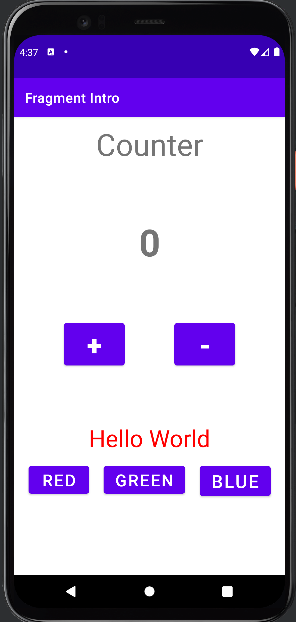

# 프래그먼트를 사용한 UI 개발

 - 프래그먼트 생명주기
 - 정적 프래그먼트와 듀얼 패인 레이아웃
 - 동적 프래그먼트
 - 젯팩 Navigation

## 1. 프래그먼트 생명주기

 - Fragment는 Activity의 일부로 존재하며, 자신만의 생명주기, UI, 이벤트 처리를 가진다.
 - 프래그먼트 생명주기는 액티비티 생명주기와 여러 면에서 매우 비슷하다.
    - 앱이 백그라운드로 전환되거나 숨겨지거나 종료될 떄에도 액티비티가 거친 단계와 동일한 단계가 프래그먼트에 발생한다.
 - onAttache
    - 프래그먼트가 이를 사용하는 액티비티와 연결되는 시점
    - 이를 통해 프래그먼트나 액티비티가 완전히 생성되기 전에도 액티비티를 참조할 수 있다.
 - onCreate
    - 프래그먼트의 초기화 작업을 수행하는 곳이다. 하지만 여기서 프래그먼트의 레이아웃을 설정하는 것은 아니다.
    - 이 시점에는 표시할 UI가 없으며, 액티비티에서 제공하는 setContentView와 같은 메서드도 사용할 수 없다.
    - 액티비티의 onCreate() 함수와 마찬가지로, savedInstanceState 매개변수를 사용해 프래그먼트가 다시 생성될 때 상태를 복원할 수 있다.
 - onCreateView
    - UI 레이아웃을 생성하는 시점
 - onViewCreated
    - 프래그먼트가 완전히 생성되고 사용자에게 표시되기 전에 호출
    - 일반적으로 여기서 뷰를 설정하고 뷰에 기능과 상호작용을 추가한다. (OnClickListener 등)
 - onActivityCreated
    - 액티비티의 onCreate가 실행된 직후 호출
    - 프래그먼ㄴ트 상태 초기화가 대부분 완료된 상태이며 필요한 경우 마지막으로 설정해야 하는 것들이 위치
 - onStart
    - 프래그먼트가 사용자에게 표시되기 직전에 호출
 - onResume
    - onResume이 호출된 이후에 프래그먼트가 사용자와 상호작용할 수 있다.
    - 일반적으로 이 콜백에서 설정이나 기능 정의를 최소한으로 한다.
    - 앱이 백그라운드로 전환되고 다시 포어그라운드로 돌아올 때마다 이 콜백이 항상 호출된다.
 - onPause
    - 앱이 백그라운드로 전환되거나 화면에서 다른 요소에 부분적으로 가려졌을 때 호출
    - onPause를 사용해 프래그먼트의 상태에 따른 변경 사항을 저장한다.
 - onStop
    - onStop이 호출된 이후에는 프래그먼트가 더 이상 사용자에게 보이지 않으며 백그라운드로 전환된다.
 - onDestroyView
    - 일반적으로 프래그먼트가 소멸되기 전에 최종 정리 작업을 수행하기 위해 호출
    - onDestroyView에서 필요한 모든 리소스를 정리
    - 프래그먼트가 백스택에 저장되면 프래그먼트를 소멸하지 않고도 이 콜백이 호출될 수 있다.
 - onDestroy
    - 프래그먼트가 소멸되는 중
    - 이는 앱이 종료되거나 이 프래그먼트가 다른 프래그먼트로 대체될 때 발생
 - onDetach
    - 프래그먼트가 액티비티에서 분리됐을 때 호출
 - 요약
    - 더 많은 프래그먼트 콜백이 있지만 대부분 이 콜백들을 사용
    - onAttach는 프래그먼트와 액티비티를 연결하기 위해 사용
    - onCreate는 프래그먼트를 초기화하기 위해 사용
    - onCreateView는 레이아웃을 설정하는 데 사용
    - onViewCreated/onActivityCreated는 추가적인 초기화를 수행
    - onPause는 정리 작업 수행

<div align="center">
    
</div>
<br/>

### 1-1. 프래그먼트 생명주기 예시 코드

 - `/res/layout/activity_main.xml`
```xml
<?xml version="1.0" encoding="utf-8"?>
<androidx.constraintlayout.widget.ConstraintLayout
    xmlns:android="http://schemas.android.com/apk/res/android"
    xmlns:tools="http://schemas.android.com/tools"
    android:layout_width="match_parent"
    android:layout_height="match_parent"
    tools:context="com.example.fragmentlifecycle.MainActivity">

    <fragment
        android:id="@+id/main_fragment"
        android:name="com.example.fragmentlifecycle.MainFragment"
        android:layout_width="match_parent"
        android:layout_height="match_parent" />

</androidx.constraintlayout.widget.ConstraintLayout>
```

 - `fragment_main.xml`
```xml
<?xml version="1.0" encoding="utf-8"?>
<FrameLayout xmlns:android="http://schemas.android.com/apk/res/android"
    xmlns:tools="http://schemas.android.com/tools"
    android:layout_width="match_parent"
    android:layout_height="match_parent"
    tools:context=".MainFragment">

    <!-- TODO: Update blank fragment layout -->
    <TextView
        android:layout_width="match_parent"
        android:layout_height="match_parent"
        android:gravity="center"
        android:text="@string/hello_blank_fragment" />

</FrameLayout>
```

 - `MainActivity`
```kotlin
class MainActivity : AppCompatActivity() {
    override fun onCreate(savedInstanceState: Bundle?) {
        super.onCreate(savedInstanceState)
        setContentView(R.layout.activity_main)
        Log.d(TAG, "onCreate: ")
    }

    override fun onStart() {
        super.onStart()
        Log.d(TAG, "onStart: ")
    }

    override fun onResume() {
        super.onResume()
        Log.d(TAG, "onResume: ")
    }

    override fun onPause() {
        super.onPause()
        Log.d(TAG, "onPause")
    }

    override fun onStop() {
        super.onStop()
        Log.d(TAG, "onStop")
    }

    override fun onDestroy() {
        super.onDestroy()
        Log.d(TAG, "onDestroy")
    }

    companion object {
        private const val TAG = "MainActivity"
    }
}
```

 - `MainFragment`
```kotlin
class MainFragment : Fragment() {
    // TODO: Rename and change types of parameters
    private var param1: String? = null
    private var param2: String? = null

    override fun onAttach(context: Context) {
        super.onAttach(context)
        Log.d(TAG, "onAttach")
    }

    override fun onCreate(savedInstanceState: Bundle?) {
        super.onCreate(savedInstanceState)
        Log.d(TAG,"onCreate")
        arguments?.let {
            param1 = it.getString(ARG_PARAM1)
            param2 = it.getString(ARG_PARAM2)
        }
    }

    // R.layout.fragment_main 레이아웃 파일을 View로 변환해서 리턴
    override fun onCreateView(
        inflater: LayoutInflater, container: ViewGroup?,
        savedInstanceState: Bundle?
    ): View? {
        Log.d(TAG,"onCreateView")
        // Inflate the layout for this fragment
        return inflater.inflate(R.layout.fragment_main, container, false)
    }

    override fun onViewCreated(view: View, savedInstanceState: Bundle?) {
        super.onViewCreated(view, savedInstanceState)
        Log.d(TAG, "onViewCreated")
    }

    override fun onStart() {
        super.onStart()
        Log.d(TAG, "onStart")
    }

    override fun onResume() {
        super.onResume()
        Log.d(TAG, "onResume")
    }

    override fun onPause() {
        super.onPause()
        Log.d(TAG, "onPause")
    }

    override fun onStop() {
        super.onStop()
        Log.d(TAG, "onStop")
    }

    override fun onDestroyView() {
        super.onDestroyView()
        Log.d(TAG, "onDestroyView")
    }

    override fun onDestroy() {
        super.onDestroy()
        Log.d(TAG, "onDestroy")
    }

    override fun onDetach() {
        super.onDetach()
        Log.d(TAG, "onDetach")
    }


    companion object {
        @JvmStatic
        fun newInstance(param1: String, param2: String) =
            MainFragment().apply {
                arguments = Bundle().apply {
                    putString(ARG_PARAM1, param1)
                    putString(ARG_PARAM2, param2)
                }
            }

        private const val TAG = "MainFragment"
    }
}
```

 - `로그`
    - onCreate: Fragment (정적 선언 시, setContentView() 중 실행됨)
    - onStart: Activity → Fragment
    - onResume: Activity → Fragment
    - 프래그먼트가 초기화되고 onCreate와 onCreateView에서 뷰가 생성되고 표시된다. 그리고 onViewCreated라는 다른 콜백이 호출되는데, 이는 프래그먼트 UI가 표시될 준비가 됐다는 것을 의미한다.
```
// 실행
2025-05-03 01:23:29.345 22361-22361 MainFragment            com.example.fragmentlifecycle        D  onAttach
2025-05-03 01:23:29.345 22361-22361 MainFragment            com.example.fragmentlifecycle        D  onCreate
2025-05-03 01:23:29.345 22361-22361 MainFragment            com.example.fragmentlifecycle        D  onCreateView
2025-05-03 01:23:29.347 22361-22361 MainFragment            com.example.fragmentlifecycle        D  onViewCreated
2025-05-03 01:23:29.347 22361-22361 MainActivity            com.example.fragmentlifecycle        D  onCreate: 
2025-05-03 01:23:29.350 22361-22361 MainFragment            com.example.fragmentlifecycle        D  onStart
2025-05-03 01:23:29.350 22361-22361 MainActivity            com.example.fragmentlifecycle        D  onStart: 
2025-05-03 01:23:29.351 22361-22361 MainActivity            com.example.fragmentlifecycle        D  onResume: 
2025-05-03 01:23:29.351 22361-22361 MainFragment            com.example.fragmentlifecycle        D  onResume

// 포어그라운드 -> 백그라운드
2025-05-03 01:23:56.772 22361-22361 MainFragment            com.example.fragmentlifecycle        D  onPause
2025-05-03 01:23:56.772 22361-22361 MainActivity            com.example.fragmentlifecycle        D  onPause
2025-05-03 01:23:57.289 22361-22394 EGL_emulation           com.example.fragmentlifecycle        D  eglMakeCurrent: 0xf157eb60: ver 2 0 (tinfo 0xe63791d0)
2025-05-03 01:23:57.328 22361-22361 MainFragment            com.example.fragmentlifecycle        D  onStop
2025-05-03 01:23:57.328 22361-22361 MainActivity            com.example.fragmentlifecycle        D  onStop

// 백그라운드 -> 포어그라운드
2025-05-03 01:24:04.563 22361-22361 MainFragment            com.example.fragmentlifecycle        D  onStart
2025-05-03 01:24:04.563 22361-22361 MainActivity            com.example.fragmentlifecycle        D  onStart: 
2025-05-03 01:24:04.564 22361-22361 MainActivity            com.example.fragmentlifecycle        D  onResume: 
2025-05-03 01:24:04.564 22361-22361 MainFragment            com.example.fragmentlifecycle        D  onResume

// 종료
2025-05-03 01:24:27.158 22361-22361 MainFragment            com.example.fragmentlifecycle        D  onPause
2025-05-03 01:24:27.158 22361-22361 MainActivity            com.example.fragmentlifecycle        D  onPause
2025-05-03 01:24:27.739 22361-22394 EGL_emulation           com.example.fragmentlifecycle        D  eglMakeCurrent: 0xf157eb60: ver 2 0 (tinfo 0xe63791d0)
2025-05-03 01:24:27.747 22361-22361 MainFragment            com.example.fragmentlifecycle        D  onStop
2025-05-03 01:24:27.747 22361-22361 MainActivity            com.example.fragmentlifecycle        D  onStop
2025-05-03 01:24:27.749 22361-22361 MainFragment            com.example.fragmentlifecycle        D  onDestroyView
2025-05-03 01:24:27.750 22361-22361 MainFragment            com.example.fragmentlifecycle        D  onDestroy
2025-05-03 01:24:27.750 22361-22361 MainFragment            com.example.fragmentlifecycle        D  onDetach
2025-05-03 01:24:27.750 22361-22361 MainActivity            com.example.fragmentlifecycle        D  onDestroy
```

### 1-2. 프래그먼트 예시 코드

<div align="center">
    
</div>
<br/>

 - `res/layout/activity_main.xml`
```xml
<?xml version="1.0" encoding="utf-8"?>
<LinearLayout xmlns:android="http://schemas.android.com/apk/res/android"
    xmlns:tools="http://schemas.android.com/tools"
    android:layout_width="match_parent"
    android:layout_height="match_parent"
    android:orientation="vertical"
    tools:context=".MainActivity">

    <fragment
        android:id="@+id/counter_fragment"
        android:name="com.example.fragmentintro.CounterFragment"
        android:layout_width="match_parent"
        android:layout_height="0dp"
        android:layout_weight="2"/>

    <fragment
        android:id="@+id/color_fragment"
        android:name="com.example.fragmentintro.ColorFragment"
        android:layout_width="match_parent"
        android:layout_height="0dp"
        android:layout_weight="1"/>

</LinearLayout>
```

 - `res/layout/fragment_counter.xml`
```xml
<?xml version="1.0" encoding="utf-8"?>
<androidx.constraintlayout.widget.ConstraintLayout xmlns:android="http://schemas.android.com/apk/res/android"
    xmlns:app="http://schemas.android.com/apk/res-auto"
    xmlns:tools="http://schemas.android.com/tools"
    android:layout_width="match_parent"
    android:layout_height="match_parent"
    tools:context=".CounterFragment">

    <TextView
        android:id="@+id/counter_text"
        ../>

    <TextView
        android:id="@+id/counter_value"
        ../>

    <Button
        android:id="@+id/plus"
        ../>

    <Button
        android:id="@+id/minus"
        ../>

</androidx.constraintlayout.widget.ConstraintLayout>
```

 - `res/layout/fragment_color.xml`
```xml
<?xml version="1.0" encoding="utf-8"?>
<androidx.constraintlayout.widget.ConstraintLayout xmlns:android="http://schemas.android.com/apk/res/android"
    xmlns:app="http://schemas.android.com/apk/res-auto"
    xmlns:tools="http://schemas.android.com/tools"
    android:layout_width="match_parent"
    android:layout_height="match_parent"
    android:fitsSystemWindows="false"
    tools:context=".ColorFragment">

    <TextView
        android:id="@+id/hello_world"
        .. />

    <Button
        android:id="@+id/red_button"
        .. />

    <Button
        android:id="@+id/green_button"
        .. />

    <Button
        android:id="@+id/blue_button"
        .. />

</androidx.constraintlayout.widget.ConstraintLayout>
```

 - `MainActivity`
```kotlin
class MainActivity : AppCompatActivity() {
    override fun onCreate(savedInstanceState: Bundle?) {
        super.onCreate(savedInstanceState)
        setContentView(R.layout.activity_main)
    }
}
```

 - `CounterFragment`
```kotlin
class CounterFragment : Fragment() {
    private var param1: String? = null
    private var param2: String? = null

    var counter  = 0

    override fun onCreate(savedInstanceState: Bundle?) {
        super.onCreate(savedInstanceState)
        arguments?.let {
            param1 = it.getString(ARG_PARAM1)
            param2 = it.getString(ARG_PARAM2)
        }
    }

    // 뷰 반환
    override fun onCreateView(
        inflater: LayoutInflater, container: ViewGroup?,
        savedInstanceState: Bundle?
    ): View? {
        // Inflate the layout for this fragment
        return inflater.inflate(R.layout.fragment_counter, container, false)
    }

    // 이벤트 등록
    override fun onViewCreated(view: View, savedInstanceState: Bundle?) {
        super.onViewCreated(view, savedInstanceState)

        val counterValue = view.findViewById<TextView>(R.id.counter_value)

        view.findViewById<Button>(R.id.plus).setOnClickListener {
            counter++
            counterValue.text = counter.toString()
        }
        view.findViewById<Button>(R.id.minus).setOnClickListener {
            if (counter > 0) {
                counter--
                counterValue.text = counter.toString()
            }
        }
    }

    companion object {
        @JvmStatic
        fun newInstance(param1: String, param2: String) =
            CounterFragment().apply {
                arguments = Bundle().apply {
                    putString(ARG_PARAM1, param1)
                    putString(ARG_PARAM2, param2)
                }
            }
    }
}
```

 - `ColorFragment`
```kotlin
class ColorFragment : Fragment() {
    private var param1: String? = null
    private var param2: String? = null

    override fun onCreate(savedInstanceState: Bundle?) {
        super.onCreate(savedInstanceState)
        arguments?.let {
            param1 = it.getString(ARG_PARAM1)
            param2 = it.getString(ARG_PARAM2)
        }
    }

    // 뷰 반환
    override fun onCreateView(
        inflater: LayoutInflater, container: ViewGroup?,
        savedInstanceState: Bundle?
    ): View? {
        // Inflate the layout for this fragment
        return inflater.inflate(R.layout.fragment_color, container, false)
    }

    // 이벤트 등록
    override fun onViewCreated(view: View, savedInstanceState: Bundle?) {
        super.onViewCreated(view, savedInstanceState)
        val redButton = view.findViewById<Button>(R.id.red_button)
        val greenButton = view.findViewById<Button>(R.id.green_button)
        val blueButton = view.findViewById<Button>(R.id.blue_button)
        val helloWorldTextView = view.findViewById<TextView>(R.id.hello_world)

        redButton.setOnClickListener {
            helloWorldTextView.setTextColor(Color.RED)
        }
        greenButton.setOnClickListener {
            helloWorldTextView.setTextColor(Color.GREEN)
        }
        blueButton.setOnClickListener {
            helloWorldTextView.setTextColor(Color.BLUE)
        }
    }


    companion object {
        @JvmStatic
        fun newInstance(param1: String, param2: String) =
            ColorFragment().apply {
                arguments = Bundle().apply {
                    putString(ARG_PARAM1, param1)
                    putString(ARG_PARAM2, param2)
                }
            }
    }
}
```

### 1-3. 프래그먼트 예시 코드 (듀얼 패인)

 - __예시 코드 설명__
    - 별자리 목록과 정보를 표시하는 간단한 앱 예시
    - 폰에서는 목록을 표시하고, 선택한 항목의 내용을 다른 화면에서 열게 된다.
    - 태블릿에서는 듀얼 패인 레이아웃의 동일한 화면 내에서 한 패인에는 목록을 표시하고 다른 패인에는 선택한 항목의 내용을 표시한다.
 - __안드로이드 해상도에 따른 layout 폴더 분기__
    - https://developer.android.com/guide/topics/resources/providing-resources?hl=ko
    - smallestWidth: layout-sw'N'dp
    - 가능한 너비: layout-w'N'dp
    - 가능한 높이: layout-h'N'dp

<br/>

#### 화면

 - `res/layout/activity_main.xml`
```xml
<?xml version="1.0" encoding="utf-8"?>
<androidx.constraintlayout.widget.ConstraintLayout xmlns:android="http://schemas.android.com/apk/res/android"
    xmlns:tools="http://schemas.android.com/tools"
    android:layout_width="match_parent"
    android:layout_height="match_parent"
    tools:context=".MainActivity">

    <fragment
        android:id="@+id/star_sign_list"
        android:name="com.example.dualpanelayouts.ListFragment"
        android:layout_height="match_parent"
        android:layout_width="match_parent"/>
        
</androidx.constraintlayout.widget.ConstraintLayout>
```
<div align="center">
    
</div>
<br/>

 - `res/layout/fragment_list.xml`
```xml
<?xml version="1.0" encoding="utf-8"?>
<ScrollView xmlns:android="http://schemas.android.com/apk/res/android"
    xmlns:tools="http://schemas.android.com/tools"
    android:layout_width="match_parent"
    android:layout_height="wrap_content"
    tools:context=".ListFragment">
    <LinearLayout
        android:layout_width="match_parent"
        android:layout_height="wrap_content"
        android:orientation="vertical">

        <TextView
            android:layout_width="match_parent"
            android:layout_height="wrap_content"
            android:gravity="center"
            android:textSize="24sp"
            android:textStyle="bold"
            style="@style/StarSignTextView"
            android:text="@string/star_signs" />

        <View
            android:layout_width="match_parent"
            android:layout_height="1dp"
            android:background="?android:attr/dividerVertical" />

        <TextView
            android:id="@+id/aquarius"
            style="@style/StarSignTextView"
            android:layout_width="match_parent"
            android:layout_height="wrap_content"
            android:text="@string/aquarius" />

        <!-- .. -->

    </LinearLayout>
</ScrollView>
```

 - `activity_detail.xml`
```xml
<?xml version="1.0" encoding="utf-8"?>
<androidx.constraintlayout.widget.ConstraintLayout xmlns:android="http://schemas.android.com/apk/res/android"
    xmlns:app="http://schemas.android.com/apk/res-auto"
    xmlns:tools="http://schemas.android.com/tools"
    android:layout_width="match_parent"
    android:layout_height="match_parent"
    tools:context=".DetailActivity">

    <fragment
        android:id="@+id/star_sign_detail"
        android:name="com.example.dualpanelayouts.DetailFragment"
        android:layout_height="match_parent"
        android:layout_width="match_parent"/>

</androidx.constraintlayout.widget.ConstraintLayout>
```

 - `res/layout/fragment_detail.xml`
```xml
<?xml version="1.0" encoding="utf-8"?>
<LinearLayout xmlns:android="http://schemas.android.com/apk/res/android"
    xmlns:tools="http://schemas.android.com/tools"
    android:layout_width="match_parent"
    android:layout_height="match_parent"
    android:orientation="vertical"
    tools:context=".DetailFragment">

    <TextView
        android:id="@+id/star_sign"
        style="@style/StarSignTextViewHeader"
        android:textStyle="bold"
        android:gravity="center"
        android:layout_width="match_parent"
        android:layout_height="wrap_content"
        tools:text="Aquarius"/>

    <TextView
        android:id="@+id/symbol"
        style="@style/StarSignTextView"
        android:layout_width="match_parent"
        android:layout_height="wrap_content"
        tools:text="Water Carrier"/>

    <TextView
        android:id="@+id/date_range"
        style="@style/StarSignTextView"
        android:layout_width="match_parent"
        android:layout_height="wrap_content"
        tools:text="Date Range: January 20 - February 18" />
</LinearLayout>
```


 - `res/layout/layout-sw600dp/activity_main.xml`
```xml
<?xml version="1.0" encoding="utf-8"?>
<LinearLayout xmlns:android="http://schemas.android.com/apk/res/android"
    xmlns:tools="http://schemas.android.com/tools"
    android:layout_width="match_parent"
    android:layout_height="match_parent"
    android:orientation="horizontal"
    tools:context=".MainActivity">

    <fragment
        android:id="@+id/star_sign_list"
        android:name="com.example.dualpanelayouts.ListFragment"
        android:layout_height="match_parent"
        android:layout_width="0dp"
        android:layout_weight="1"/>

    <View
        android:layout_width="1dp"
        android:layout_height="match_parent"
        android:background="?android:attr/dividerVertical" />

    <fragment
        android:id="@+id/star_sign_detail"
        android:name="com.example.dualpanelayouts.DetailFragment"
        android:layout_height="match_parent"
        android:layout_width="0dp"
        android:layout_weight="2"/>
</LinearLayout>
```
<div align="center">
    
</div>
<br/>

##### 코드

 - `MainActivity`
```kotlin
const val STAR_SIGN_ID = "STAR_SIGN_ID"
interface StarSignListener {
    fun onSelected(id: Int)
}
class MainActivity : AppCompatActivity(), StarSignListener {
    var isDualPane: Boolean = false
    override fun onCreate(savedInstanceState: Bundle?) {
        super.onCreate(savedInstanceState)
        setContentView(R.layout.activity_main)
        isDualPane = findViewById<View>(R.id.star_sign_detail) != null
    }

    override fun onSelected(id: Int) {
        if (isDualPane) {
            val detailFragment = supportFragmentManager
                .findFragmentById(R.id.star_sign_detail) as DetailFragment
            detailFragment.setStarSignData(id)
        } else {
            val detailIntent = Intent(this, DetailActivity::class.java)
                .apply {
                    putExtra(STAR_SIGN_ID, id)
                }
            startActivity(detailIntent)
        }

    }
}
```

 - `ListFragment`
```kotlin
class ListFragment : Fragment(), View.OnClickListener {
    // TODO: Rename and change types of parameters
    private var param1: String? = null
    private var param2: String? = null

    private lateinit var starSignListener: StarSignListener
    override fun onAttach(context: Context) {
        super.onAttach(context)
        if (context is StarSignListener) {
            starSignListener = context
        } else {
            throw RuntimeException("Must implement StarSignListener")
        }
    }

    override fun onCreate(savedInstanceState: Bundle?) {
        super.onCreate(savedInstanceState)
        arguments?.let {
            param1 = it.getString(ARG_PARAM1)
            param2 = it.getString(ARG_PARAM2)
        }
    }

    override fun onCreateView(
        inflater: LayoutInflater, container: ViewGroup?,
        savedInstanceState: Bundle?
    ): View? {
        // Inflate the layout for this fragment
        return inflater.inflate(R.layout.fragment_list, container, false)
    }

    override fun onViewCreated(view: View, savedInstanceState:Bundle?) {
        super.onViewCreated(view, savedInstanceState)
        val starSigns = listOf<View>(
            view.findViewById(R.id.aquarius),
            view.findViewById(R.id.pisces),
            view.findViewById(R.id.aries),
            view.findViewById(R.id.taurus),
            view.findViewById(R.id.gemini),
            view.findViewById(R.id.cancer),
            view.findViewById(R.id.leo),
            view.findViewById(R.id.virgo),
            view.findViewById(R.id.libra),
            view.findViewById(R.id.scorpio),
            view.findViewById(R.id.sagittarius),
            view.findViewById(R.id.capricorn)
        )
        starSigns.forEach {
            it.setOnClickListener(this)
        }
    }
    override fun onClick(v: View?) {
        v?.let { starSign ->
            starSignListener.onSelected(starSign.id)
        }
    }

companion object {
        @JvmStatic
        fun newInstance(param1: String, param2: String) =
            ListFragment().apply {
                arguments = Bundle().apply {
                    putString(ARG_PARAM1, param1)
                    putString(ARG_PARAM2, param2)
                }
            }
    }
}
```

 - `DetailFragment`
```kotlin
class DetailFragment : Fragment() {
    // TODO: Rename and change types of parameters
    private var param1: String? = null
    private var param2: String? = null

    private val starSign: TextView?
        get() = view?.findViewById(R.id.star_sign)
    private val symbol: TextView?
        get() = view?.findViewById(R.id.symbol)
    private val dateRange: TextView?
        get() = view?.findViewById(R.id.date_range)

    override fun onCreate(savedInstanceState: Bundle?) {
        super.onCreate(savedInstanceState)
        arguments?.let {
            param1 = it.getString(ARG_PARAM1)
            param2 = it.getString(ARG_PARAM2)
        }
    }
    override fun onCreateView(
        inflater: LayoutInflater, container: ViewGroup?, savedInstanceState: Bundle?): View? {
        // Inflate the layout for this fragment
        return inflater.inflate(R.layout.fragment_detail, container,false)
    }
    fun setStarSignData(starSignId: Int) {
        when (starSignId) {
            R.id.aquarius -> {
                starSign?.text = getString(R.string.aquarius)
                symbol?.text = getString(R.string.symbol, "Water Carrier")
                dateRange?.text = getString(R.string.date_range, "January 20 - February 18")
            }
            R.id.pisces -> {
                starSign?.text = getString(R.string.pisces)
                symbol?.text = getString(R.string.symbol, "Fish")
                dateRange?.text = getString(R.string.date_range, "February 19 - March 20")
            }
            R.id.aries -> {
                starSign?.text = getString(R.string.aries)
                symbol?.text = getString(R.string.symbol, "Ram")
                dateRange?.text = getString(R.string.date_range, "March 21 - April 19")
            }
            R.id.taurus -> {
                starSign?.text = getString(R.string.taurus)
                symbol?.text = getString(R.string.symbol, "Bull")
                dateRange?.text = getString(R.string.date_range, "April 20 - May 20")
            }
            R.id.gemini -> {
                starSign?.text = getString(R.string.gemini)
                symbol?.text = getString(R.string.symbol, "Twins")
                dateRange?.text = getString(R.string.date_range, "May 21 - June 20")
            }
            R.id.cancer -> {
                starSign?.text = getString(R.string.cancer)
                symbol?.text = getString(R.string.symbol, "Crab")
                dateRange?.text = getString(R.string.date_range, "June 21 - July 22")
            }
            R.id.leo -> {
                starSign?.text = getString(R.string.leo)
                symbol?.text = getString(R.string.symbol, "Lion")
                dateRange?.text = getString(R.string.date_range, "July 23 - August 22")
            }
            R.id.virgo -> {
                starSign?.text = getString(R.string.virgo)
                symbol?.text = getString(R.string.symbol, "Virgin")
                dateRange?.text = getString(R.string.date_range, "August 23 - September 22")
            }
            R.id.libra -> {
                starSign?.text = getString(R.string.libra)
                symbol?.text = getString(R.string.symbol, "Scales")
                dateRange?.text = getString(R.string.date_range, "September 23 - October 22")
            }
            R.id.scorpio -> {
                starSign?.text = getString(R.string.scorpio)
                symbol?.text = getString(R.string.symbol, "Scorpion")
                dateRange?.text = getString(R.string.date_range, "October 23 - November 21")
            }
            R.id.sagittarius -> {
                starSign?.text = getString(R.string.sagittarius)
                symbol?.text = getString(R.string.symbol, "Archer")
                dateRange?.text = getString(R.string.date_range, "November 22 - December 21")
            }
            R.id.capricorn -> {
                starSign?.text = getString(R.string.capricorn)
                symbol?.text = getString(R.string.symbol, "Mountain Goat")
                dateRange?.text = getString(R.string.date_range, "December 22 - January 19")
            }
            else -> {
                Toast.makeText(context, getString(R.string.unknown_star_sign), Toast.LENGTH_LONG).show()
            }
        }
    }

    companion object {
        @JvmStatic
        fun newInstance(param1: String, param2: String) =
            DetailFragment().apply {
                arguments = Bundle().apply {
                    putString(ARG_PARAM1, param1)
                    putString(ARG_PARAM2, param2)
                }
            }
    }
}
```

 - `DetailActivity`
```kotlin
class DetailActivity : AppCompatActivity() {
    override fun onCreate(savedInstanceState: Bundle?) {
        super.onCreate(savedInstanceState)
        setContentView(R.layout.activity_detail)
        val starSignId = intent.extras?.getInt(STAR_SIGN_ID, 0) ?: 0
        val detailFragment = supportFragmentManager .findFragmentById(R.id.star_sign_detail) as DetailFragment
        detailFragment.setStarSignData(starSignId)
    }

}
```
