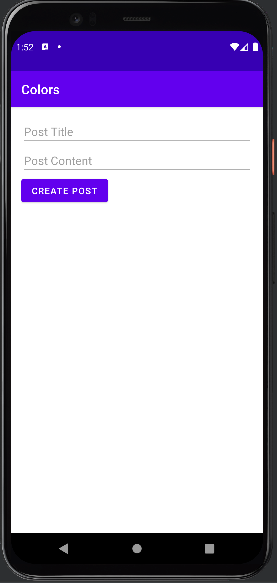

# 게시판 CRUD 예시

## 1. 구성 개요

 - 백엔드
    - Node.js + Express로 REST API 구현 (게시글 CRUD)
 - 안드로이드
    - Retrofit으로 백엔드 API 호출.
    - ViewModel로 데이터 관리.
    - MainActivity에서 TextView로 게시글 표시.
    - Hlit을 통한 의존성 주입.

<div align="center">
    
</div>
<br/>

## 2. 백엔드 서버 (Node.js + Express)

 - `server.js`
    - POST /posts: 새 게시글 생성
    - GET /posts: 모든 게시글 조회
    - GET /posts/:id: 특정 게시글 조회
    - PUT /posts/:id: 게시글 수정
    - DELETE /posts/:id: 게시글 삭제
```javascript
const express = require('express');
const app = express();
app.use(express.json());

let posts = [
    { id: 1, title: "First Post", content: "Hello, World!" }
];

let nextId = 2;

// Create
app.post('/posts', (req, res) => {
    const { title, content } = req.body;
    if (!title || !content) {
        return res.status(400).json({ error: "Title and content are required" });
    }

    const post = { id: nextId++, title, content };
    posts.push(post);
    res.status(201).json(post);
});

// Read (All)
app.get('/posts', (req, res) => {
    res.json(posts);
});

// Read (Single)
app.get('/posts/:id', (req, res) => {
    const post = posts.find(p => p.id === parseInt(req.params.id));
    if (!post) {
        return res.status(404).json({ error: "Post not found" });
    }

    res.json(post);
});

// Update
app.put('/posts/:id', (req, res) => {
    const post = posts.find(p => p.id === parseInt(req.params.id));
    if (!post) {
        return res.status(404).json({ error: "Post not found" });
    }

    const { title, content } = req.body;
    if (!title || !content) {
        return res.status(400).json({ error: "Title and content are required" });
    }

    post.title = title;
    post.content = content;
    res.json(post);
});

// Delete
app.delete('/posts/:id', (req, res) => {
    const index = posts.findIndex(p => p.id === parseInt(req.params.id));
    if (index === -1) {
        return res.status(404).json({ error: "Post not found" });
    }

    posts.splice(index, 1);
    res.status(204).send();
});

app.listen(3000, () => {
    console.log('Server running on http://localhost:3000');
});
```

## 3. 안드로이드 앱

 - `build.gradle (프로젝트 수준)`
```kotlin
plugins {
    id("com.google.dagger.hilt.android") version "2.51.1" apply false
}
```

 - `build.gradle (모듈 수준)`
```kotlin
plugins {
    id("com.android.application")
    id("org.jetbrains.kotlin.android")
    id("com.google.dagger.hilt.android")
}

dependencies {
    implementation("com.google.dagger:hilt-android:2.51.1")
    kapt("com.google.dagger:hilt-compiler:2.51.1")
    implementation("com.squareup.retrofit2:retrofit:2.11.0")
    implementation("com.squareup.retrofit2:converter-gson:2.11.0")
    implementation("androidx.lifecycle:lifecycle-viewmodel-ktx:2.8.4")
    implementation("androidx.lifecycle:lifecycle-livedata-ktx:2.8.4")
    implementation("org.jetbrains.kotlinx:kotlinx-coroutines-android:1.8.1")
}

// Hilt 어노테이션 프로세싱
kapt {
    correctErrorTypes = true
}
```

 - `AndroidManifest.xml`
```xml
<?xml version="1.0" encoding="utf-8"?>
<manifest xmlns:android="http://schemas.android.com/apk/res/android">

    <!-- 인터넷 권한 추가 -->
    <uses-permission android:name="android.permission.INTERNET" />

    <application
        android:name=".MyApplication"
        android:allowBackup="true"
        android:icon="@mipmap/ic_launcher"
        android:label="@string/app_name"
        android:roundIcon="@mipmap/ic_launcher_round"
        android:supportsRtl="true"
        android:theme="@style/Theme.MyApp">
        <activity android:name=".MainActivity">
            <intent-filter>
                <action android:name="android.intent.action.MAIN" />
                <category android:name="android.intent.category.LAUNCHER" />
            </intent-filter>
        </activity>
    </application>

</manifest>
```

 - `MyApplication`
```kotlin
package com.example.myapp

import android.app.Application
import dagger.hilt.android.HiltAndroidApp

@HiltAndroidApp
class MyApplication : Application()
```

 - `Post & ApiService`
```kotlin
// 모델 클래스
package com.example.myapp

data class Post(
    val id: Int,
    val title: String,
    val content: String
)

// Retrofit 인터페이스
package com.example.myapp

import retrofit2.http.Body
import retrofit2.http.DELETE
import retrofit2.http.GET
import retrofit2.http.POST
import retrofit2.http.PUT
import retrofit2.http.Path

interface ApiService {
    @GET("posts")
    suspend fun getPosts(): List<Post>

    @POST("posts")
    suspend fun createPost(@Body post: Post): Post

    @PUT("posts/{id}")
    suspend fun updatePost(@Path("id") id: Int, @Body post: Post): Post

    @DELETE("posts/{id}")
    suspend fun deletePost(@Path("id") id: Int)
}
```

 - `NetworkModule`
    - @Module: 의존성을 제공하는 클래스.
    - @InstallIn(SingletonComponent::class): 앱 전체에서 단일 인스턴스를 사용.
    - @Provides: Retrofit과 ApiService를 생성해 제공.
    - @Singleton: Retrofit과 ApiService가 앱 수명 동안 단일 인스턴스로 유지.
```kotlin
package com.example.myapp

import dagger.Module
import dagger.Provides
import dagger.hilt.InstallIn
import dagger.hilt.components.SingletonComponent
import retrofit2.Retrofit
import retrofit2.converter.gson.GsonConverterFactory
import javax.inject.Singleton

@Module
@InstallIn(SingletonComponent::class)
object NetworkModule {
    @Provides
    @Singleton
    fun provideRetrofit(): Retrofit {
        return Retrofit.Builder()
            .baseUrl("http://10.0.2.2:3000/") // 에뮬레이터용 URL
            .addConverterFactory(GsonConverterFactory.create())
            .build()
    }

    @Provides
    @Singleton
    fun provideApiService(retrofit: Retrofit): ApiService {
        return retrofit.create(ApiService::class.java)
    }
}
```

 - `PostViewModel`
    - @HiltViewModel: ViewModel이 Hilt로 관리됨.
    - @Inject constructor: ApiService를 Hilt가 주입.
    - ApiClient.apiService 대신 주입된 apiService 사용.
```kotlin
package com.example.myapp

import androidx.lifecycle.LiveData
import androidx.lifecycle.MutableLiveData
import androidx.lifecycle.ViewModel
import androidx.lifecycle.viewModelScope
import dagger.hilt.android.lifecycle.HiltViewModel
import kotlinx.coroutines.launch
import javax.inject.Inject

@HiltViewModel
class PostViewModel @Inject constructor(
    private val apiService: ApiService
) : ViewModel() {
    private val _posts = MutableLiveData<List<Post>>()
    val posts: LiveData<List<Post>> = _posts

    private val _error = MutableLiveData<String>()
    val error: LiveData<String> = _error

    fun fetchPosts() {
        viewModelScope.launch {
            try {
                val postList = apiService.getPosts()
                _posts.value = postList
            } catch (e: Exception) {
                _error.value = "Failed to fetch posts: ${e.message}"
            }
        }
    }

    fun createPost(title: String, content: String) {
        viewModelScope.launch {
            try {
                val newPost = Post(0, title, content) // ID는 서버에서 생성
                val createdPost = apiService.createPost(newPost)
                fetchPosts() // Listing 갱신
            } catch (e: Exception) {
                _error.value = "Failed to create post: ${e.message}"
            }
        }
    }
}
```

 - `MainActivity`
```kotlin
package com.example.myapp

import android.os.Bundle
import android.widget.Button
import android.widget.EditText
import android.widget.TextView
import androidx.activity.viewModels
import androidx.appcompat.app.AppCompatActivity
import androidx.lifecycle.Observer
import dagger.hilt.android.AndroidEntryPoint

@AndroidEntryPoint
class MainActivity : AppCompatActivity() {
    private val viewModel: PostViewModel by viewModels()

    override fun onCreate(savedInstanceState: Bundle?) {
        super.onCreate(savedInstanceState)
        setContentView(R.layout.activity_main)

        val titleEditText = findViewById<EditText>(R.id.titleEditText)
        val contentEditText = findViewById<EditText>(R.id.contentEditText)
        val createButton = findViewById<Button>(R.id.createButton)
        val postsTextView = findViewById<TextView>(R.id.postsTextView)

        // 게시글 목록 관찰
        viewModel.posts.observe(this, Observer { posts ->
            postsTextView.text = posts.joinToString("\n") { "${it.id}: ${it.title} - ${it.content}" }
        })

        // 에러 메시지 관찰
        viewModel.error.observe(this, Observer { error ->
            postsTextView.text = error
        })

        // 게시글 생성 버튼
        createButton.setOnClickListener {
            val title = titleEditText.text.toString()
            val content = contentEditText.text.toString()
            if (title.isNotEmpty() && content.isNotEmpty()) {
                viewModel.createPost(title, content)
                titleEditText.text.clear()
                contentEditText.text.clear()
            }
        }

        // 초기 게시글 목록 가져오기
        viewModel.fetchPosts()
    }
}
```

 - `activity_main.xml`
```xml
<?xml version="1.0" encoding="utf-8"?>
<LinearLayout xmlns:android="http://schemas.android.com/apk/res/android"
    android:layout_width="match_parent"
    android:layout_height="match_parent"
    android:orientation="vertical"
    android:padding="16dp">

    <EditText
        android:id="@+id/titleEditText"
        android:layout_width="match_parent"
        android:layout_height="wrap_content"
        android:hint="Post Title" />

    <EditText
        android:id="@+id/contentEditText"
        android:layout_width="match_parent"
        android:layout_height="wrap_content"
        android:hint="Post Content" />

    <Button
        android:id="@+id/createButton"
        android:layout_width="wrap_content"
        android:layout_height="wrap_content"
        android:text="Create Post" />

    <TextView
        android:id="@+id/postsTextView"
        android:layout_width="match_parent"
        android:layout_height="wrap_content"
        android:layout_marginTop="16dp" />

</LinearLayout>
```
